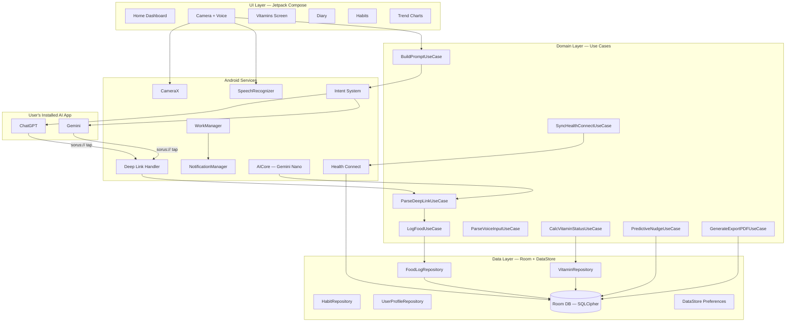
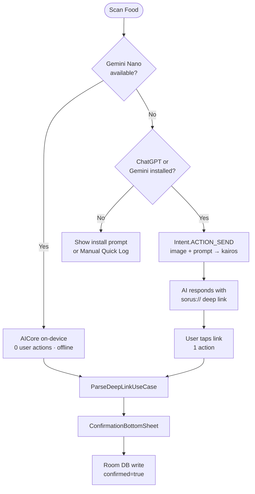
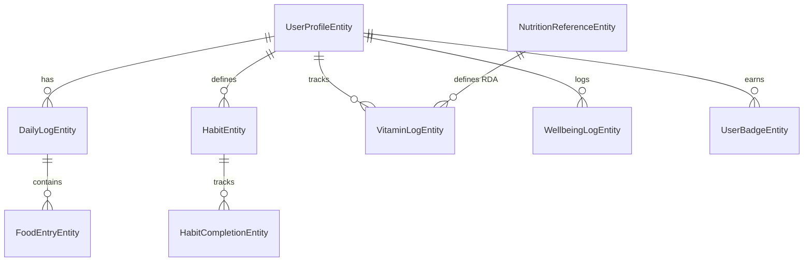

# Sorus — Android Application Architecture
## Technical Architecture Document · Production Reference

> **App Name**: Sorus
> **Platform**: Android only (API 26+ min · API 35 target)
> **Language**: Kotlin · **UI**: Jetpack Compose
> **Pattern**: Clean Architecture + MVVM + Repository + Hilt DI
> **State**: ViewModel + StateFlow
> **Philosophy**: Offline-first · Zero-API-cost AI · Privacy-first · No data leaves device (V3)
> **UI Style**: Apple Watch / Whoop-inspired · dark glassmorphism · liquid animations
> **Last Updated**: February 2026

---

## Table of Contents

1. [Executive Summary](#1-executive-summary)
2. [Tech Stack & Dependencies](#2-tech-stack--dependencies)
3. [Project Module Structure](#3-project-module-structure)
4. [System Architecture Overview](#4-system-architecture-overview)
5. [Feature: AI Food Analysis — Zero-Cost](#5-feature-ai-food-analysis--zero-cost)
6. [Feature: Voice Logging](#6-feature-voice-logging)
7. [Feature: Vitamin & Nutrient Tracking](#7-feature-vitamin--nutrient-tracking)
8. [Feature: Health Connect Integration](#8-feature-health-connect-integration)
9. [Feature: Trend & Overview](#9-feature-trend--overview)
10. [Feature: Habit Tracker](#10-feature-habit-tracker)
11. [Feature: Smart Features](#11-feature-smart-features)
12. [Local Database — Room Schema](#12-local-database--room-schema)
13. [Navigation Architecture](#13-navigation-architecture)
14. [UI/UX — Glassmorphism Design System](#14-uiux--glassmorphism-design-system)
15. [Edge Cases & Risk Mitigation](#15-edge-cases--risk-mitigation)
16. [Security & Data Privacy](#16-security--data-privacy)
17. [Testing Strategy](#17-testing-strategy)
18. [Build & CI/CD](#18-build--cicd)
19. [Development Roadmap](#19-development-roadmap)

---

## 1. Executive Summary

### 1.1 What is Sorus?

Sorus is a privacy-first, offline Android health tracking app. Its primary differentiator: **premium AI food analysis at zero per-query cost**, achieved by routing food photos through the user's already-installed ChatGPT or Gemini app via Android Intents. On supported hardware (Pixel 8+, Galaxy S24+), on-device Gemini Nano removes the need for any external app.

Secondary pillars: micronutrient deficiency tracking with absorption-aware logic, voice-powered food logging, habit streaks, Health Connect sync, and Whoop-inspired glass UI.

### 1.2 Core Principles

| Principle | Implementation |
|:---|:---|
| **Offline-first** | All data in local Room DB (SQLCipher AES-256). No mandatory cloud. |
| **Zero-cost AI** | Android Intent → ChatGPT/Gemini. On-device: Gemini Nano via AICore. |
| **Privacy-first** | No PII leaves device. UUID only. No INTERNET permission in V3. |
| **Confirmation-gated** | All AI-sourced data requires explicit user tap before saving. |
| **Progressive enhancement** | Gemini Nano → External AI → Manual. Graceful degradation. |

### 1.3 Why Not a Cloud API?

| Approach | Problem |
|:---|:---|
| OpenAI Vision API | ~$0.01–0.03/image · 10K DAU = $300/day = $9K/month |
| Google Cloud Vision | Similar at scale |
| Self-hosted model | DevOps overhead + GPU cost |
| On-device TFLite | Food recognition only, no reasoning |

**Solution**: User's ChatGPT Plus / Gemini subscription becomes Sorus's inference layer. Cost to Sorus: **$0.00/query**.

---

## 2. Tech Stack & Dependencies

### 2.1 Core

| Category | Tech | Version |
|:---|:---|:---|
| Language | Kotlin | 2.0+ |
| Min SDK | Android 8.0 | API 26 |
| Target SDK | Android 15 | API 35 |
| UI | Jetpack Compose + Material3 | BOM 2024.09 |
| DI | Hilt (Dagger 2) | 2.52+ |
| Navigation | Compose Navigation | 2.8+ |
| Architecture | Clean Arch + MVVM | — |

### 2.2 Key Dependencies

```kotlin
// --- Compose ---
implementation(platform("androidx.compose:compose-bom:2024.09.00"))
implementation("androidx.compose.ui:ui")
implementation("androidx.compose.material3:material3")
implementation("androidx.navigation:navigation-compose:2.8+")

// --- Architecture ---
implementation("androidx.lifecycle:lifecycle-viewmodel-compose:2.8+")
implementation("com.google.dagger:hilt-android:2.52")
kapt("com.google.dagger:hilt-android-compiler:2.52")

// --- Room + Encryption ---
implementation("androidx.room:room-runtime:2.6+")
implementation("androidx.room:room-ktx:2.6+")
kapt("androidx.room:room-compiler:2.6+")
implementation("net.zetetic:android-database-sqlcipher:4.5.4")

// --- Camera ---
implementation("androidx.camera:camera-camera2:1.4+")
implementation("androidx.camera:camera-lifecycle:1.4+")
implementation("androidx.camera:camera-view:1.4+")
implementation("id.zelory:compressor:3.0.1")

// --- Health Connect ---
implementation("androidx.health.connect:connect-client:1.1+")

// --- WorkManager ---
implementation("androidx.work:work-runtime-ktx:2.9+")
implementation("androidx.hilt:hilt-work:1.2+")

// --- Gemini Nano / AICore ---
implementation("com.google.ai.edge.aicore:aicore:0.0.1-exp01")

// --- Voice (SpeechRecognizer) ---
// Platform API — no extra dependency

// --- PDF generation (doctor export) ---
implementation("com.itextpdf:itext7-core:7.2.5")

// --- Backup ---
implementation("androidx.datastore:datastore-preferences:1.1+")
implementation("org.jetbrains.kotlinx:kotlinx-serialization-json:1.7+")

// --- Charts (Trend graphs) ---
implementation("com.patrykandpatrick.vico:compose-m3:1.14+")

// --- Coroutines ---
implementation("org.jetbrains.kotlinx:kotlinx-coroutines-android:1.8+")
```

---

## 3. Project Module Structure

```
sorus/
├── app/                        # Application class, DI graph root, MainActivity
├── core/
│   ├── core-ui/                # Sorus theme, tokens, shared Composables, animations
│   ├── core-data/              # Room DB, DAOs, Repository implementations
│   ├── core-domain/            # Use cases, domain models, repository interfaces
│   ├── core-common/            # Extensions, constants, date utils
│   └── core-testing/           # Fakes, test helpers
├── feature/
│   ├── feature-home/           # Dashboard, score ring, quick cards
│   ├── feature-camera/         # CameraX, AI routing, voice logging
│   ├── feature-diary/          # Food diary list, day view
│   ├── feature-vitamins/       # Vitamin bars, deficiency logic
│   ├── feature-habits/         # Habit CRUD, heatmap, streaks
│   ├── feature-overview/       # 7-day trend charts, stats summary
│   ├── feature-profile/        # Settings, goals, export, backup
│   └── feature-onboarding/     # First-run flow
└── buildSrc/                   # Version catalog, shared build logic
```

---

## 4. System Architecture Overview



### 4.1 Data Flow

```
UI (Compose) ──StateFlow──▶ ViewModel ──invoke()──▶ UseCase ──calls──▶ Repository ──queries──▶ Room
             ◀──collectAsState()                                                     ◀──Flow<T>
```

---

## 5. Feature: AI Food Analysis — Zero-Cost

### 5.1 Routing Logic



### 5.2 Deep Link Schema

```
sorus://log?v=1&meal=[type]&items=[name],[cal],[prot],[carb],[fat]|...
```

**Example:**
```
sorus://log?v=1&meal=lunch&items=GrilledChicken,310,32,0,7|WhiteRice,220,4,46,1
```

### 5.3 AndroidManifest.xml

```xml
<activity android:name=".MainActivity" android:launchMode="singleTask" android:exported="true">
    <intent-filter>
        <action android:name="android.intent.action.MAIN"/>
        <category android:name="android.intent.category.LAUNCHER"/>
    </intent-filter>
    <!-- Deep link return -->
    <intent-filter>
        <action android:name="android.intent.action.VIEW"/>
        <category android:name="android.intent.category.DEFAULT"/>
        <category android:name="android.intent.category.BROWSABLE"/>
        <data android:scheme="sorus" android:host="log"/>
    </intent-filter>
    <!-- Share-back from AI app -->
    <intent-filter>
        <action android:name="android.intent.action.SEND"/>
        <category android:name="android.intent.category.DEFAULT"/>
        <data android:mimeType="text/plain"/>
    </intent-filter>
</activity>
```

### 5.4 Prompt Template (v1)

```
You are a precision nutrition analyst. Analyze the food in the attached image.
For EACH item: specific name (CamelCase), calories (kcal), protein(g), carbs(g), fat(g).
After your explanation, output ONLY on a new line (no markdown, no spaces):
sorus://log?v=1&meal=[MEAL_TYPE]&items=[name],[cal],[prot],[carb],[fat]|...
Rules: integers for cal; one decimal max for macros; meal = breakfast|lunch|dinner|snack
```

### 5.5 ParseDeepLinkUseCase

```kotlin
operator fun invoke(rawUri: String): ParseResult = try {
    val uri = Uri.parse(rawUri)
    val meal = MealType.fromApi(uri.getQueryParameter("meal"))
    val items = uri.getQueryParameter("items")!!.split("|").map {
        val p = it.split(",")
        require(p.size == 5 && p[0].isNotBlank() && p[1].toInt() in 0..5000)
        ParsedFoodItem(p[0], p[1].toInt(), p[2].toFloat(), p[3].toFloat(), p[4].toFloat(),
            needsReview = p[1].toInt() > 2000)
    }
    ParseResult.Success(meal!!, items)
} catch (e: Exception) { ParseResult.Failure(e.message ?: "Parse error") }
```

### 5.6 Fallback Chain

| Tier | Mechanism | User Actions |
|:---|:---|:---|
| 1 | Gemini Nano (AICore — Android 14+) | 0 |
| 2 | External AI → `sorus://` deep link | 1 tap |
| 3 | External AI → Share text back to Sorus | 2 taps |
| 4 | Manual Quick Log (offline USDA DB) | 5+ taps |

---

## 6. Feature: Voice Logging

### 6.1 Flow

1. User long-presses mic FAB or speaks "I ate half an orange"
2. Android `SpeechRecognizer` captures phrase (on-device, no API cost)
3. `ParseVoiceInputUseCase` extracts food name + quantity via regex + USDA local DB lookup
4. `ConfirmationBottomSheet` pre-fills result for user review
5. User confirms → `LogFoodUseCase` saves

### 6.2 Implementation

```kotlin
class VoiceLogService @Inject constructor(
    @ApplicationContext private val context: Context,
    private val parseVoiceInputUseCase: ParseVoiceInputUseCase
) {
    fun startListening(onResult: (String) -> Unit) {
        val recognizer = SpeechRecognizer.createSpeechRecognizer(context)
        val intent = Intent(RecognizerIntent.ACTION_RECOGNIZE_SPEECH).apply {
            putExtra(RecognizerIntent.EXTRA_LANGUAGE_MODEL, RecognizerIntent.LANGUAGE_MODEL_FREE_FORM)
            putExtra(RecognizerIntent.EXTRA_LANGUAGE, Locale.getDefault())
            putExtra(RecognizerIntent.EXTRA_MAX_RESULTS, 1)
        }
        recognizer.setRecognitionListener(object : RecognitionListener {
            override fun onResults(results: Bundle) {
                val text = results.getStringArrayList(SpeechRecognizer.RESULTS_RECOGNITION)?.firstOrNull()
                text?.let { onResult(it) }
            }
            // ... other listener stubs
        })
        recognizer.startListening(intent)
    }
}
```

### 6.3 ParseVoiceInputUseCase

Extracts: quantity words ("half", "two", "a cup of") + food name → searches local USDA nutrient DB → returns `ParsedFoodItem` with estimated macros. Ambiguous inputs return `NeedsManualReview` with options.

---

## 7. Feature: Vitamin & Nutrient Tracking

### 7.1 Full Nutrient List

| Nutrient | RDA (M/F) | Unit | Tracking |
|:---|:---|:---|:---|
| Vitamin A | 900 / 700 | mcg | AI log |
| Vitamin B1 (Thiamine) | 1.2 / 1.1 | mg | AI log |
| Vitamin B2 (Riboflavin) | 1.3 / 1.1 | mg | AI log |
| Vitamin B3 (Niacin) | 16 / 14 | mg | AI log |
| Vitamin B5 (Pantothenic) | 5 / 5 | mg | AI log |
| Vitamin B6 | 1.3 / 1.3 | mg | AI log |
| Vitamin B7 (Biotin) | 30 / 30 | mcg | AI log |
| Vitamin B9 (Folate) | 400 / 400 | mcg | AI log |
| Vitamin B12 | 2.4 / 2.4 | mcg | AI log |
| Vitamin C | 90 / 75 | mg | AI log |
| Vitamin D | 600 / 600 | IU | AI log + manual |
| Vitamin E | 15 / 15 | mg | AI log |
| Vitamin K | 120 / 90 | mcg | AI log |
| Magnesium | 420 / 320 | mg | AI log |
| Collagen (Hydroxyproline proxy) | 10,000 / 10,000 | mg | Manual |
| Protein | per goal | g | AI log |
| Iron | 8 / 18 | mg | AI log |
| Calcium | 1,000 / 1,000 | mg | AI log |
| Zinc | 11 / 8 | mg | AI log |

**RDA source**: NIH Dietary Reference Intakes 2024.

### 7.2 Deficiency Level & Color Coding

```kotlin
enum class DeficiencyLevel(val color: Color) {
    OPTIMAL  (Color(0xFF00E0FF)),   // Teal — ≥ 80%
    ADEQUATE (Color(0xFF4CAF50)),   // Green — 60–79%
    LOW      (Color(0xFFFFB700)),   // Amber/Gold — 40–59%
    DEFICIENT(Color(0xFFFF8C00)),   // Orange — < 40%
    CRITICAL (Color(0xFFFF4444))    // Red — < 15%
}

fun calcDeficiency(percent: Float): DeficiencyLevel = when {
    percent >= 80f -> OPTIMAL
    percent >= 60f -> ADEQUATE
    percent >= 40f -> LOW
    percent >= 15f -> DEFICIENT
    else           -> CRITICAL
}
```

### 7.3 Absorption Modifiers

Applied by `CalcVitaminStatusUseCase` before displaying percentage:

| Modifier Rule | Effect |
|:---|:---|
| Vitamin A logged with fat-containing meal | `+20%` effective absorption |
| Vitamin D + magnesium logged same day | `+15%` Vitamin D effective |
| Iron + Vitamin C same meal | `+25%` Iron effective |
| Calcium + Vitamin D logged together | `+10%` Calcium |
| Zinc + high-phytate meal (beans, grains) | `-30%` Zinc effective |

Modifiers are applied to compute `effectiveIntake` — stored separately from `rawIntake`.

### 7.4 Burn Adjustments from Health Connect

```kotlin
suspend fun applyBurnAdjustments(vitaminStatus: List<VitaminStatus>): List<VitaminStatus> {
    val steps      = healthConnect.readTodaySteps()
    val sleepHours = healthConnect.readLastNightSleep()
    val avgHR      = healthConnect.readAvgRestingHR()
    val burnCals   = healthConnect.readActiveCaloriesBurned()

    return vitaminStatus.map { vs ->
        val burnMultiplier = when {
            burnCals > 600 -> 1.20f  // High activity — needs +20%
            burnCals > 300 -> 1.10f
            sleepHours < 6 -> 1.15f  // Poor sleep increases B vitamin need
            else           -> 1.00f
        }
        vs.copy(adjustedRDA = vs.baseRDA * burnMultiplier)
    }
}
```

### 7.5 Predictive Nudges

`PredictiveNudgeUseCase` runs nightly via WorkManager. It looks at the last 3-day trend per nutrient and generates next-day predictions:

```
"Based on today's meals, Vitamin C will reach 62% tomorrow — on track."
"You've skipped greens 2 days running. Vitamin K predicted to drop to 28% tomorrow."
"Iron trending low — consider lentils or fortified cereal at breakfast."
```

Nudges are delivered as `NotificationCompat` on `KAIROS_VITAMIN_ALERTS` channel.

---
## 8. Feature: Health Connect Integration

### 8.1 Required Permissions

```xml
<uses-permission android:name="android.permission.health.READ_STEPS"/>
<uses-permission android:name="android.permission.health.READ_SLEEP"/>
<uses-permission android:name="android.permission.health.READ_HEART_RATE"/>
<uses-permission android:name="android.permission.health.READ_ACTIVE_CALORIES_BURNED"/>
<uses-permission android:name="android.permission.health.READ_WEIGHT"/>
<uses-permission android:name="android.permission.health.WRITE_NUTRITION"/>
<uses-permission android:name="android.permission.health.WRITE_HYDRATION"/>
```

### 8.2 Read Operations

| Data Type | Record Class | Used For |
|:---|:---|:---|
| Steps | `StepsRecord` | Burn adjustment multiplier |
| Sleep | `SleepSessionRecord` | B-vitamin RDA adjustment |
| Resting HR | `HeartRateRecord` | Stress-based caloric adjustments |
| Active calories | `ActiveCaloriesBurnedRecord` | Burn multiplier for RDA |
| Weight | `WeightRecord` | Goal calorie calculations |
| Height | `HeightRecord` | BMR/TDEE calculation |

### 8.3 Write Operations (opt-in)

After user confirms a food entry, Sorus optionally writes to Health Connect:

```kotlin
suspend fun writeNutrition(entry: FoodEntry) {
    healthConnectClient.insertRecords(listOf(
        NutritionRecord(
            startTime = entry.loggedAt,
            endTime   = entry.loggedAt.plusSeconds(1),
            energy    = Energy.kilocalories(entry.caloriesKcal.toDouble()),
            protein   = Mass.grams(entry.proteinG.toDouble()),
            totalCarbohydrate = Mass.grams(entry.carbsG.toDouble()),
            totalFat  = Mass.grams(entry.fatG.toDouble()),
            name      = entry.foodName
        )
    ))
}
```

### 8.4 Permission Revocation Handling

Sorus checks `HealthConnectClient.getGrantedPermissions()` on each foreground resume. If previously granted permissions are revoked, a non-blocking banner is shown with a re-request CTA. Health sync is silently disabled until re-granted — all other app features remain functional.

### 8.5 Sync Triggers

| Trigger | Implementation |
|:---|:---|
| App foreground | `repeatOnLifecycle(RESUMED)` in SyncViewModel |
| After food log confirmed | Inline call in `LogFoodUseCase` |
| Background refresh | `PeriodicWorkRequest` every 15 min, `KEEP` policy |
| Manual pull-to-refresh | User gesture on Home screen |

---

## 9. Feature: Trend & Overview

### 9.1 7-Day Trend Charts

Built with **Vico** (`com.patrykandpatrick.vico:compose-m3`). One sparkline chart per nutrient on the Overview screen. Chart color matches the nutrient's current `DeficiencyLevel` color.

```kotlin
@Composable
fun NutrientTrendChart(dataPoints: List<Float>, deficiencyLevel: DeficiencyLevel) {
    val chartEntryModel = entryModelOf(*dataPoints.mapIndexed { i, v -> i.toFloat() to v }.toTypedArray())
    Chart(
        chart = lineChart(lines = listOf(lineSpec(lineColor = deficiencyLevel.color))),
        model = chartEntryModel,
        modifier = Modifier.fillMaxWidth().height(80.dp)
    )
}
```

### 9.2 Stats Summary

- **Weekly average** per nutrient (% of RDA)
- **Best / Worst day** highlights
- **Protein total** vs. goal (auto-adjusted for weight + activity)
- **Streak leaderboard**: which habits held longest

### 9.3 Habit Heatmap

52 × 7 grid of 12dp squares. Color: `#00E0FF` at varying alpha (0.15 + ratio × 0.85). Empty days: `#2A2A2A`. Rendered as `LazyVerticalGrid` in Compose.

---

## 10. Feature: Habit Tracker

### 10.1 Habit CRUD

Each `Habit` has: name, icon, color, recurrence (`DAILY | WEEKDAYS | WEEKENDS | CUSTOM`), optional reminder time, streak counters.

### 10.2 Streak Calculation — WorkManager

```kotlin
val streakWork = PeriodicWorkRequestBuilder<HabitStreakWorker>(1, TimeUnit.DAYS)
    .setInitialDelay(computeDelayUntilMidnight(), TimeUnit.MILLISECONDS)
    .build()
WorkManager.getInstance(context).enqueueUniquePeriodicWork(
    "habit_streak", ExistingPeriodicWorkPolicy.KEEP, streakWork
)
```

`HabitStreakWorker`: For each habit scheduled yesterday — if `HabitCompletion` row exists → `streak_current++`, else → `streak_current = 0`. Updates `streak_best` if exceeded.

### 10.3 Badges

| Badge | Trigger |
|:---|:---|
| 🔥 First Flame | 3-day streak on any habit |
| 💎 Diamond | 30-day streak |
| 🌟 Centurion | 100-day streak |
| 📅 Consistent | 7/7 days in a week all habits |

Badges stored in `UserBadgeEntity`. Triggered in `HabitStreakWorker`.

---

## 11. Feature: Smart Features

### 11.1 Food Swaps

When a vitamin bar is in `LOW` or `DEFICIENT` state (< 60%), user can tap the bar. A bottom sheet appears with:
- **Why this is low**: "No leafy greens today — Vitamin K at 28%"
- **Smart swaps**: 3 food suggestions each with quick-add button (pulls from local USDA DB filtered by that nutrient)
- **One-tap add**: adds swap to log with confirmation

### 11.2 Feedback Loop — "How Do You Feel?"

A scheduled nightly card (appearing in Home screen at 9 PM) asks:
```
"How's your energy today?" ┌──────────────────────────────┐
                           │  😴 Low  🙂 Okay  ⚡ Great  │
                           └──────────────────────────────┘
```
Response is stored in `WellbeingLogEntity`. `PredictiveNudgeUseCase` correlates wellbeing scores with vitamin levels across 7-day history to adjust nudge messaging.

### 11.3 Doctor Export — 30-Day PDF

`GenerateExportPDFUseCase` uses iText7 to produce a PDF. Triggered from Profile screen.

**PDF sections:**
1. Patient info header (name, age, date range)
2. Calorie & macro summary table (7-day averages)
3. Vitamin status table: each nutrient, avg %, RDA, trend arrow (↑ ↓ →)
4. Wellbeing log (daily energy scores)
5. Notable alerts (days with critical deficiencies)
6. Disclaimer footer

PDF is saved to **app-private external storage** (`getExternalFilesDir(Environment.DIRECTORY_DOCUMENTS)`) then shared via `FileProvider + ACTION_SEND`.

### 11.4 Local Encrypted Backups

**Export**: Sorus serializes the entire Room DB as a JSON blob (via Kotlin Serialization), encrypts it with AES-256-GCM using a key from Android Keystore, and writes to a `.sorusbackup` file. User picks destination via `Intent(Intent.ACTION_CREATE_DOCUMENT)`.

**Import**: User picks `.sorusbackup` file via `Intent(Intent.ACTION_OPEN_DOCUMENT)`. File is decrypted and deserialized into Room entities. Existing data is replaced after user confirmation.

```kotlin
// Backup export
suspend fun exportBackup(): Uri {
    val json = sorusSerializer.serializeDatabase(db)
    val encrypted = aesEncryption.encrypt(json.toByteArray())
    val file = File(context.getExternalFilesDir(DIRECTORY_DOCUMENTS), "sorus_${today}.sorusbackup")
    file.writeBytes(encrypted)
    return FileProvider.getUriForFile(context, "${context.packageName}.fileprovider", file)
}
```

---

## 12. Local Database — Room Schema

**DB**: `SorusDatabase.kt` · SQLCipher AES-256 · Key in Android Keystore

```kotlin
@Database(
    entities = [UserProfileEntity::class, DailyLogEntity::class, FoodEntryEntity::class,
                HabitEntity::class, HabitCompletionEntity::class, VitaminLogEntity::class,
                NutritionReferenceEntity::class, WellbeingLogEntity::class, UserBadgeEntity::class],
    version = 1, exportSchema = true
)
abstract class SorusDatabase : RoomDatabase()
```

### Key Entities

#### UserProfileEntity
```kotlin
@Entity(tableName = "user_profile")
data class UserProfileEntity(
    @PrimaryKey val userId: String,          // UUID v4
    val name: String, val dateOfBirth: String,
    val gender: String, val heightCm: Float, val weightKg: Float,
    val activityLevel: String,               // sedentary|light|moderate|active|very_active
    val calorieGoalKcal: Int,
    val proteinGoalG: Float, val carbGoalG: Float, val fatGoalG: Float,
    val preferredAiApp: String,              // chatgpt|gemini|aicore|manual
    val healthConnectOptIn: Boolean,
    val createdAt: Long, val updatedAt: Long
)
```

#### FoodEntryEntity
```kotlin
@Entity(tableName = "food_entry")
data class FoodEntryEntity(
    @PrimaryKey val entryId: String,
    val logId: String,                        // FK → daily_log
    val mealType: String,
    val foodName: String,
    val portionDescription: String,
    val caloriesKcal: Int,
    val proteinG: Float, val carbsG: Float, val fatG: Float, val fiberG: Float?,
    val source: String,                       // ai_deeplink|voice|manual|barcode
    val aiRawResponse: String?,               // Stored 30 days then purged
    val loggedAt: Long,
    val confirmedByUser: Boolean              // Always false until user taps "Log Meal"
)
```

#### VitaminLogEntity
```kotlin
@Entity(tableName = "vitamin_log")
data class VitaminLogEntity(
    @PrimaryKey val logId: String,
    val userId: String,
    val date: String,                         // YYYY-MM-DD
    val nutrientId: String,                   // FK → nutrition_reference
    val rawIntakeAmount: Float,
    val effectiveIntakeAmount: Float,         // After absorption modifiers
    val adjustedRda: Float,                   // After burn adjustments
    val percentComplete: Float,               // effectiveIntakeAmount / adjustedRda * 100
    val deficiencyLevel: String               // OPTIMAL|ADEQUATE|LOW|DEFICIENT|CRITICAL
)
```

#### WellbeingLogEntity
```kotlin
@Entity(tableName = "wellbeing_log")
data class WellbeingLogEntity(
    @PrimaryKey val wellbeingId: String,
    val userId: String,
    val date: String,
    val energyScore: Int,                     // 1=Low, 2=Okay, 3=Great
    val note: String?,
    val loggedAt: Long
)
```

### ER Diagram



---

## 13. Navigation Architecture

```kotlin
sealed class Screen(val route: String) {
    object Home        : Screen("home")
    object Log         : Screen("log")          // Camera + Voice picker
    object Diary       : Screen("diary?date={date}")
    object Vitamins    : Screen("vitamins")
    object Overview    : Screen("overview")
    object Habits      : Screen("habits")
    object Profile     : Screen("profile")
    object Onboarding  : Screen("onboarding")
    object Confirmation: Screen("confirmation/{encodedUri}")
    object FoodSwaps   : Screen("swaps/{nutrientId}")
}
```

**Bottom nav tabs** (5):

| Tab | Icon | Route |
|:---|:---|:---|
| Home | `Icons.Rounded.Home` | `home` |
| Log | `Icons.Rounded.Add` | Camera/Voice modal |
| Diary | `Icons.Rounded.MenuBook` | `diary` |
| Overview | `Icons.Rounded.BarChart` | `overview` |
| Profile | `Icons.Rounded.Person` | `profile` |

---
## 14. UI/UX — Apple iOS 17 Light-Mode Design System

> **Last Updated**: February 21, 2026  
> **Implemented Phases**: 1-4  
> **Design Framework**: Material3 + Apple HIG semantics

### 14.1 Design Philosophy

AURIS follows **Apple iOS 17 Human Interface Guidelines** color scheme (light mode). Inspiration from Apple Health + Fitness ecosystem: clean, minimal, soft shadows, semantic colors (primary/secondary/label), white grouping cards, no glassmorphism effects (deferred to future phases — current implementation is light iOS standard).

**Design Principles**:
- **Light background** (neutral grays, not dark)
- **Semantic colors**: Blue primary, Green positive, Red/Orange alerts
- **Grouped white cards**: iOS-style sections with inset separators
- **Smooth animations**: animateFloatAsState on progress bars, stagger delays on list items
- **Typography**: System font stack via Material3 (not custom Inter)

### 14.2 Color Tokens — Actual Implementation

**File**: `app/src/main/kotlin/com/auris/ui/theme/Colors.kt`

```kotlin
object AurisColors {
    // ── System Backgrounds (iOS 17 light mode)
    val BgPrimary   = Color(0xFFF2F2F7)   // systemGroupedBackground — light gray
    val BgSecondary = Color(0xFFFFFFFF)   // secondarySystemGroupedBackground — white cards
    val BgTertiary  = Color(0xFFEFEFF4)   // tertiarySystemGroupedBackground

    // ── Labels (iOS semantics)
    val LabelPrimary     = Color(0xFF000000)       // Black text
    val LabelSecondary   = Color(0x993C3C43)       // ~60% opacity gray
    val LabelTertiary    = Color(0x4D3C3C43)       // ~30% opacity gray
    val LabelQuaternary  = Color(0x2E3C3C43)       // ~18% opacity gray

    // ── Status/Deficiency colors (iOS system)
    val Green       = Color(0xFF34C759)            // iOS systemGreen — optimal ≥80%
    val Blue        = Color(0xFF007AFF)            // iOS systemBlue — adequate 60-79%
    val Orange      = Color(0xFFFF9500)            // iOS systemOrange — low 40-59%
    val Red         = Color(0xFFFF3B30)            // iOS systemRed — deficient <40%
    val Red2        = Color(0xFFFF2D55)            // iOS systemPink — critical <15%

    // ── Backward-compatible aliases (DeficiencyLevel.kt references)
    val StatusOptimal   = Green
    val StatusAdequate  = Blue
    val StatusLow       = Orange
    val StatusDeficient = Red
    val StatusCritical  = Red2

    // ── Separator (inset lines in grouped cards)
    val Separator       = Color(0x1F3C3C43)        // ~12% opacity

    // ── Semantic color mapper
    fun pctColor(pct: Int): Color = when {
        pct >= 80 -> Green          // Optimal
        pct >= 60 -> Blue           // Adequate
        pct >= 40 -> Orange         // Low
        else      -> Red            // Deficient or Critical
    }
}
```

### 14.3 Theme Wrapper

**File**: `app/src/main/kotlin/com/auris/ui/theme/SorusTheme.kt` (⚠️ Rename to AurisTheme in Phase 5)

```kotlin
private val AurisLightColorScheme = lightColorScheme(
    primary          = AurisColors.Blue,
    onPrimary        = AurisColors.BgSecondary,
    secondary        = AurisColors.Green,
    background       = AurisColors.BgPrimary,     // Light gray grouped bg
    surface          = AurisColors.BgSecondary,   // White cards
    onBackground     = AurisColors.LabelPrimary,  // Black text
    onSurface        = AurisColors.LabelPrimary
)

@Composable
fun AurisTheme(content: @Composable () -> Unit) {
    MaterialTheme(
        colorScheme = AurisLightColorScheme,
        typography  = AurisTypography,
        content     = content
    )
}
```

### 14.4 Typography

**File**: `app/src/main/kotlin/com/auris/ui/theme/Typography.kt`

```kotlin
val AurisTypography = Typography(
    displayLarge  = TextStyle(fontSize = 34.sp, fontWeight = FontWeight.Bold, letterSpacing = (-0.5).sp),
    displayMedium = TextStyle(fontSize = 28.sp, fontWeight = FontWeight.Bold),
    displaySmall  = TextStyle(fontSize = 22.sp, fontWeight = FontWeight.Bold),
    headlineLarge = TextStyle(fontSize = 32.sp, fontWeight = FontWeight.Bold),
    headlineMedium= TextStyle(fontSize = 28.sp, fontWeight = FontWeight.Bold),
    headlineSmall = TextStyle(fontSize = 24.sp, fontWeight = FontWeight.Bold),
    titleLarge    = TextStyle(fontSize = 22.sp, fontWeight = FontWeight.SemiBold),
    titleMedium   = TextStyle(fontSize = 18.sp, fontWeight = FontWeight.SemiBold),
    titleSmall    = TextStyle(fontSize = 16.sp, fontWeight = FontWeight.SemiBold),
    bodyLarge     = TextStyle(fontSize = 17.sp, fontWeight = FontWeight.Normal),
    bodyMedium    = TextStyle(fontSize = 15.sp, fontWeight = FontWeight.Normal),
    bodySmall     = TextStyle(fontSize = 13.sp, fontWeight = FontWeight.Normal),
    labelLarge    = TextStyle(fontSize = 15.sp, fontWeight = FontWeight.SemiBold),
    labelMedium   = TextStyle(fontSize = 13.sp, fontWeight = FontWeight.SemiBold),
    labelSmall    = TextStyle(fontSize = 11.sp, fontWeight = FontWeight.SemiBold)
)
```

### 14.5 Core Components Implemented

#### GlassCard.kt
 Simple white rounded container with border and padding.

```kotlin
@Composable
fun GlassCard(
    modifier: Modifier = Modifier,
    content: @Composable ColumnScope.() -> Unit
) {
    Box(
        modifier = modifier
            .clip(RoundedCornerShape(20.dp))
            .background(AurisColors.BgSecondary)  // White
            .border(1.dp, AurisColors.Separator, RoundedCornerShape(20.dp))
            .padding(16.dp)
    ) {
        Column(content = content)
    }
}
```

#### VitaminBarRow.kt — Animated Progress Bar Component

**Features Implemented**:
- ✅ Colored icon square (36×36 with 9dp corner)
- ✅ Nutrient name + LOW badge (when <40%)
- ✅ Percentage + amount/unit (right-aligned)
- ✅ Animated progress bar (1200ms animateFloatAsState)
- ✅ Bar color semantic: green/blue/orange/red per pct
- ✅ No animation on mount (visible = rememberState, LaunchedEffect)

```kotlin
@Composable
fun VitaminBarRow(
    name: String,
    icon: ImageVector,
    iconColor: Color,
    percent: Int,
    amount: String,
    unit: String,
    isLow: Boolean = false,
    isLast: Boolean = false
) {
    val pctColor = AurisColors.pctColor(percent)
    val animPct by animateFloatAsState(
        targetValue = percent / 100f,
        animationSpec = tween(1200, easing = FastOutSlowInEasing),
        label = "bar_$name"
    )
    // ... renders icon square, name, LOW badge, %, animated bar
}
```

#### LiquidColumn.kt — Hero Vertical Tube (Home Screen)

**Used for**: Water intake, Body status, Steps (left/center/right on Home hero section)

```kotlin
@Composable
fun LiquidColumn(
    label: String,
    value: String,
    unit: String,
    pct: Int,
    gradTop: Color,
    gradBot: Color,
    icon: ImageVector,
    accentColor: Color
) {
    // Value + unit label
    // Vertical tube: 52dp × 250dp, white/40% bg, white/60% border
    // Liquid fill: animateFloatAsState, vertical gradient
    // Label below tube
}
```

#### LiquidTubeCard.kt — Compact Tube with Wave Animation

**Features Implemented**:
- ✅ 100dp × 160dp vertical tube
- ✅ Short name + percentage label
- ✅ Canvas-based sine-wave surface animation
- ✅ InfiniteTransition wave only when pct < 80%
- ✅ Gradient fill (top→bot color per deficiency level)
- ✅ Stagger animation via delayMs parameter

```kotlin
@Composable
fun LiquidTubeCard(
    vitamin: VitaminStatus,
    delayMs: Int = 0
) {
    val animatedFill by animateFloatAsState(
        targetValue = vitamin.percentFraction,
        animationSpec = tween(900, delayMillis = delayMs, easing = FastOutSlowInEasing),
        label = "tube_${vitamin.nutrientId.name}"
    )
    val shouldWave = vitamin.percentFraction < 0.80f
    val wavePhase by infiniteTransition.animateFloat(
        initialValue = 0f,
        targetValue = (2 * PI).toFloat(),
        animationSpec = infiniteRepeatable(tween(1_500, easing = LinearEasing)),
        label = "wavePhase"
    )
    // Canvas draws liquid tube with optional wave
}
```

#### AurisBottomNav.kt (SorusBottomNav.kt) — Floating Pill Tab Bar

**Features Implemented** ✅:
- ✅ Floating pill: 90% width, 72dp height, 999dp border radius
- ✅ Background: white/semi-opaque with shadow
- ✅ 5 tabs + center FAB (56dp blue)
- ✅ Active tab highlight circle animation
- ✅ Icons from Material Icons (Home, Add, Book, Chart, Person)

```kotlin
@Composable
fun AurisBottomNav(
    currentRoute: String?,
    onTabSelected: (AurisTab) -> Unit
) {
    Box(modifier = Modifier.align(Alignment.BottomCenter).padding(bottom = 16.dp)) {
        Row(
            modifier = Modifier
                .fillMaxWidth(0.9f)
                .height(72.dp)
                .clip(RoundedCornerShape(999.dp))
                .background(Color(0xF0F9F9F9))  // White/semi-opaque
                .shadow(8.dp, RoundedCornerShape(999.dp))
        ) {
            // 5 tabs with active highlight
        }
        // Central blue FAB above pill
        Button(...) { onTabSelected(AurisTab(...)) }
    }
}
```

### 14.6 Home Screen Layout — Actual Implementation

**File**: `app/src/main/kotlin/com/auris/feature/home/HomeScreen.kt`

**Sections** (top to bottom):

1. **Greeting + Date** (Large title + subtitle)
   - "Hi, Mr. Kotha" — Bold 34sp
   - Today's date — Secondary 15sp

2. **AI Search Bar** (Pastel gradient border pill)
   - Mic icon + placeholder "Ask AI..."
   - Gradient border (blue→purple→green)
   - White inner fill (70% opacity)

3. **Hero Row** (380dp height)
   - **Left**: LiquidColumn (Water, 2.5L, 75%)
   - **Center**: RingWidget (Body Score, 82%)
   - **Right**: LiquidColumn (Steps, 6,240 steps)
   - Gradient backgrounds per column

4. **Habits** (Horizontal scrollable chips)
   - Example chips: "Morning Walk", "8-Hour Sleep", "Hydration"
   - Filled/outline based on completion status

5. **Quick Vitamin Cards** (Top 4 vitamins, white grouped card)
   - Uses VitaminBarRow component
   - Pulls from VitaminViewModel top-four override
   - Scrollable if >4 vitamins shown

### 14.7 Vitamins Screen Layout

**File**: `app/src/main/kotlin/com/auris/feature/vitamins/VitaminsScreen.kt`

**Sections**:

1. **Header** (Like Home greeting)
   - "Vitamins" — Bold 34sp
   - "Today's Intake · Feb 21" — Secondary 15sp

2. **Grouped White Card** (All 19 nutrients)
   - Column of VitaminBarRow components
   - 0.5px inset separator between rows
   - Last row has no separator (isLast parameter)
   - Scrollable via Column.verticalScroll()

### 14.8 Log Screen Layout

**File**: `app/src/main/kotlin/com/auris/feature/log/LogScreen.kt`

**Sections**:

1. **Header**
   - "Food Log" — Bold 34sp
   - "What did you eat today?" — Secondary 15sp

2. **Manual Food Form** (In a GlassCard)
   - Text field: "Food name"
   - Number field: "Calories"
   - Number field: "Protein (g)"
   - Number field: "Carbs (g)"
   - Number field: "Fat (g)"
   - Dropdown: Meal type

3. **Add Button** (Primary blue)
   - Label: "Add Meal"
   - On click: Snackbar "Meal logged!"

4. **Food Log List** (LazyColumn)
   - Displays past logged entries (empty on first visit)
   - Scroll-able

### 14.9 Diary Screen — Placeholder

**File**: `app/src/main/kotlin/com/auris/feature/diary/DiaryScreen.kt`

**Implemented**:
- ✅ Calendar strip (M T W T F S with day numbers)
- ✅ Daily Goal card (white grouped, calorie progress)
- ✅ Habit list (white grouped rows)
- ✅ Interactive date selection (tap date in strip)

### 14.10 Deficiency Level Color Mapping — Implementation

**File**: `app/src/main/kotlin/com/auris/domain/model/DeficiencyLevel.kt`

```kotlin
enum class DeficiencyLevel(val color: Color) {
    OPTIMAL  (AurisColors.Green),      // ≥80%
    ADEQUATE (AurisColors.Blue),       // 60–79%
    LOW      (AurisColors.Orange),     // 40–59%
    DEFICIENT(AurisColors.Red),        // <40%
    CRITICAL (AurisColors.Red2);       // <15%

    companion object {
        fun of(percentFraction: Float): DeficiencyLevel = when {
            percentFraction >= 0.80f -> OPTIMAL
            percentFraction >= 0.60f -> ADEQUATE
            percentFraction >= 0.40f -> LOW
            percentFraction >= 0.15f -> DEFICIENT
            else                     -> CRITICAL
        }
    }
}
```

### 14.11 Animation Patterns

**Progress Bar Animation** (VitaminBarRow, LiquidColumn, LiquidTubeCard):
```kotlin
val animPct by animateFloatAsState(
    targetValue = percent / 100f,
    animationSpec = tween(durationMillis = 1200, easing = FastOutSlowInEasing),
    label = "animation_name"
)
```

**Wave Animation** (LiquidTubeCard):
```kotlin
val infiniteTransition = rememberInfiniteTransition(label = "wave")
val wavePhase by infiniteTransition.animateFloat(
    initialValue = 0f,
    targetValue = (2 * PI).toFloat(),
    animationSpec = infiniteRepeatable(tween(1_500, easing = LinearEasing)),
    label = "wavePhase"
)
```

**No Stagger Currently** (Could be applied in Phase 5 enhancement by introducing delay in LaunchedEffect or via animateFloatAsState delayMillis parameter — currently uses delayMs in LiquidTubeCard but not exercised in VitaminsScreen).

### 14.12 Asset & Icon Status

**Icons**: Material Icons (Icons.Outlined.*, Icons.Filled.*) — no custom SVG assets yet  
**Drawables**: Only ic_launcher.xml files exist  
**Fonts**: System default (no custom font files)  

### 14.13 Known UI/UX Deviations

| Planned | Implemented | Status | Notes |
|:---|:---|:---|:---|
| Dark theme (Whoop-inspired glassmorphism) | Light theme (iOS 17 HIG) | ⚠️ Different | Original plan envisioned dark theme; actual implementation is light iOS — this is a design direction change |
| Inter typography custom fonts | Material3 system fonts | ⚠️ Different | Custom font files not included; using Material3 defaults (satisfactory, but different from plan) |
| Glassmorphic cards (blur + opacity) | White solid cards (iOS style) | ⚠️ Different | Glass blur effects deferred (Android backdrop blur requires API 31+); current white cards are iOS-authentic |
| GlassCard blur effect | No blur (solid white bg) | ⚠️ Different | Backdrop blur not implemented; could be added as Modifier.graphicsLayer.renderEffect in Phase 5 |
| Emoji in center of Home | AI search bar + hero tubes + habit cards | ✅ Richer design | Better visual hierarchy than placeholder emoji |
| Bottom nav glow/ripple on active | Bottom nav opacity shift + highlight circle | ⚠️ Simpler | Glow effect not implemented; highlight circle is sufficient |


**Wave/ripple effect**: A `InfiniteTransition` `animateFloat` oscillates the fill height ±2dp at 1.5s period, giving the liquid tube a breathing wave effect. Applied only when `percentComplete < 80`.

### 14.6 Vitamin Bar Row (Full-Width, Default View)

```kotlin
@Composable
fun VitaminBarRow(vitamin: VitaminStatus, onTap: () -> Unit) {
    Column(modifier = Modifier.fillMaxWidth().clickable { onTap() }.padding(vertical = 6.dp)) {
        Row(Modifier.fillMaxWidth(), horizontalArrangement = Arrangement.SpaceBetween) {
            Row(verticalAlignment = Alignment.CenterVertically) {
                Icon(painter = vitaminIcon(vitamin.nutrientId),
                    tint = vitamin.deficiencyLevel.color, modifier = Modifier.size(16.dp))
                Spacer(Modifier.width(6.dp))
                Text(vitamin.name, style = MaterialTheme.typography.bodyMedium, color = SorusColors.TextPrimary)
            }
            Text("${vitamin.displayValue} ${vitamin.unit}", style = MaterialTheme.typography.bodyMedium,
                color = SorusColors.TextPrimary)
        }
        Spacer(Modifier.height(4.dp))
        // Track
        Box(modifier = Modifier.fillMaxWidth().height(8.dp).clip(RoundedCornerShape(4.dp))
            .background(Color(0xFF2A2A2A))) {
            // Animated fill
            val animPct by animateFloatAsState(
                targetValue = vitamin.percentComplete / 100f,
                animationSpec = tween(700, easing = FastOutSlowInEasing)
            )
            Box(modifier = Modifier.fillMaxWidth(animPct).fillMaxHeight()
                .background(Brush.horizontalGradient(SorusColors.gradientVitaminBar)))
        }
        if (vitamin.deficiencyLevel == DeficiencyLevel.DEFICIENT ||
            vitamin.deficiencyLevel == DeficiencyLevel.CRITICAL) {
            Spacer(Modifier.height(2.dp))
            DeficiencyBadge(level = vitamin.deficiencyLevel)
        }
    }
}
```

### 14.7 Animation Specifications

| Animation | Duration | Easing | Trigger |
|:---|:---|:---|:---|
| Vitamin bar fill | 700ms | `FastOutSlowInEasing` | Screen load + new log |
| Bar row stagger | 60ms offset/row | — | Screen load |
| Liquid tube wave | 1500ms loop ±2dp | `LinearEasing` | Always when <80% |
| Score ring pulse | 2000ms loop scale 1.0→1.03→1.0 | `EaseInOut` | When score ≥80% |
| Glass card hover | 150ms scale 1.0→1.02 | `EaseOut` | Press |
| FAB ripple | 300ms radial expand | `EaseOut` | Tap |
| Sheet slide-up | 350ms | `spring(dampingRatio=0.75f)` | Deep link received |
| NavBar active glow | 300ms | `LinearOutSlowInEasing` | Tab switch |
| Pencil tab shake | 300ms 4-keyframe | `LinearEasing` | Log tab press |
| Habit chip wipe | 250ms left→right fill | `FastOutSlowInEasing` | Habit complete tap |
| Confetti burst | 500ms 3-particle | — | Habit complete |

### 14.8 Typography

All text uses **Inter** (Google Fonts). Load via `downloadable fonts` or bundle TTF in `assets/fonts/`.

| Token | Weight | Size | Usage |
|:---|:---|:---|:---|
| `displayLarge` | Bold | 32sp | Splash title |
| `headlineLarge` | Bold | 24sp | Screen titles, greeting |
| `headlineMedium` | SemiBold | 20sp | Card titles |
| `bodyLarge` | Regular | 16sp | Body, list items |
| `bodyMedium` | Medium | 15sp | Nutrient values |
| `labelLarge` | Bold | 12sp | Caps section headers |
| `labelSmall` | Regular | 10sp | Nav labels, micro caps |
| `displayMedium` | Bold | 28sp | Calorie ring center |

---

## 15. Edge Cases & Risk Mitigation

| ID | Risk | Severity | Mitigation |
|:---|:---|:---|:---|
| R1 | No ChatGPT/Gemini installed | 🔴 High | Detect via PackageManager; show install CTA; Manual Quick Log always available |
| R2 | AI ignores format → no deep link | 🟡 Med | Regex fallback in ParseSharedTextUseCase; NLP extraction; manual text field |
| R3 | OEM kills Sorus between Intent and deep link | 🟡 Med | `WorkManager KEEP` stores pending URI; `onResume()` checks DataStore for queued parse |
| R4 | AI hallucinates calorie values | 🔴 High | `confirmed_by_user=false` always; ⚠️ flag if cal > 2000/item; user edits before save |
| R5 | Health Connect permissions revoked | 🟢 Low | Non-blocking banner; H.C. disabled; core features unaffected |
| R6 | Voice recognition fails / no match | 🟢 Low | Falls back to Manual Quick Log; shows "Try again" with camera option |
| R7 | Room migration failure on upgrade | 🔴 High | `exportSchema=true`; `Migration(n,n+1)` unit tested; auto-migration where possible |
| R8 | Backup file corrupted on import | 🟡 Med | Validate JSON schema before Room import; show error + cancel safely |
| R9 | iText PDF crash on memory-constrained device | 🟡 Med | Cap history to 30 days; generate in `CoroutineWorker` with `OutOfMemoryError` catch |
| R10 | SpeechRecognizer unavailable (no Google app) | 🟢 Low | Check `SpeechRecognizer.isRecognitionAvailable(context)` before showing mic button |

---

## 16. Security & Data Privacy

| Layer | Implementation |
|:---|:---|
| Database | SQLCipher AES-256 · key per-installation in Android Keystore hardware module |
| Key generation | `MasterKey` with `AES256_GCM` · `StrongBoxBacked` where chipset supports |
| User identifier | Local `UUID.randomUUID()` — no email, phone, or biometric |
| Network | No INTERNET permission in V3. Zero network calls. |
| AI raw response | `aiRawResponse` purged after 30 days by `PurgeOldResponsesWorker` |
| Health Connect | Explicit per-permission grant; revocable in Android Settings; read-only unless user enables write |
| FileProvider | Image URIs scoped per-Intent with `FLAG_GRANT_READ_URI_PERMISSION` |
| Backup files | AES-256-GCM encrypted before written to storage. Key in Android Keystore. |
| PDF export | App-private directory; shared only via explicit user `createDocument` intent |
| ProGuard | `isMinifyEnabled = true`; Room models annotated `@Keep` |

**AndroidManifest V3 — no network permission declared:**
```xml
<uses-permission android:name="android.permission.CAMERA"/>
<uses-permission android:name="android.permission.POST_NOTIFICATIONS"/>
<uses-permission android:name="android.permission.RECEIVE_BOOT_COMPLETED"/>
<uses-permission android:name="android.permission.RECORD_AUDIO"/>
<!-- INTERNET intentionally omitted in V3 -->
```

---

## 17. Testing Strategy

### 17.1 Unit Tests

| Class | File | Focus |
|:---|:---|:---|
| `ParseDeepLinkUseCase` | `ParseDeepLinkUseCaseTest` | Valid / malformed URIs; per-field bounds; flag logic |
| `ParseVoiceInputUseCase` | `ParseVoiceInputUseCaseTest` | Quantity words; ambiguous inputs; USDA lookup |
| `CalcVitaminStatusUseCase` | `CalcVitaminStatusTest` | Absorption modifiers; burn adjustments; deficiency levels |
| `PredictiveNudgeUseCase` | `PredictiveNudgeTest` | 3-day trend prediction; wellbeing correlation |
| `HabitStreakCalculator` | `HabitStreakTest` | Midnight boundary; timezone; missed-day streak reset |
| `GenerateExportPDFUseCase` | `ExportPDFTest` | Non-null output; section presence; 30-day cutoff |

### 17.2 Integration Tests

- **Room round-trip**: FoodEntry write → read → verify fields
- **DeepLink → Room**: Intent → `onNewIntent` → parse → confirm → Room write
- **Health Connect mock**: Fake HealthConnectClient → verify burn adjustment applied
- **Backup/restore**: Export → corrupt-file guard → import → assert identical entity count

### 17.3 UI Tests (Compose)

```kotlin
@Test fun `vitamin bar shows LOW badge when below 40 percent`() {
    composeTestRule.setContent {
        KairosTheme { VitaminBarRow(vitamin = deficientVitamin, onTap = {}) }
    }
    composeTestRule.onNodeWithText("LOW").assertIsDisplayed()
    composeTestRule.onNodeWithText(deficientVitamin.name).assertIsDisplayed()
}
```

### 17.4 Device Test Matrix

| Device | Android | API | Focus |
|:---|:---|:---|:---|
| Pixel 8 Pro | 15 | 35 | AICore, deep link, Gemini Nano |
| Galaxy S24 | One UI 7 | 35 | OEM kill, Samsung Intent quirks |
| Pixel 7a | 14 | 34 | No AICore fallback, performance |
| Galaxy A54 | 14 | 34 | Mid-range glass performance |
| Pixel 5 (legacy) | 13 | 33 | Min-target compat, no RenderEffect |

---

## 18. Build & CI/CD

### 18.1 Build Variants

```kotlin
buildTypes {
    debug   { applicationIdSuffix = ".debug"; isDebuggable = true; isMinifyEnabled = false }
    release { isMinifyEnabled = true; isShrinkResources = true
              proguardFiles(getDefaultProguardFile("proguard-android-optimize.txt"), "proguard-rules.pro") }
}
productFlavors {
    create("staging")    { applicationIdSuffix = ".staging" }
    create("production") { }
}
```

### 18.2 GitHub Actions CI Pipeline

```yaml
name: Sorus CI
on: [push, pull_request]
jobs:
  unit-test:
    runs-on: ubuntu-latest
    steps:
      - uses: actions/checkout@v4
      - uses: actions/setup-java@v4
        with: { java-version: '21', distribution: 'temurin' }
      - run: ./gradlew testStagingDebugUnitTest
      - run: ./gradlew lint
      - run: ./gradlew assembleStagingDebug
  ui-test:
    runs-on: macos-latest
    steps:
      - uses: actions/checkout@v4
      - uses: reactivecircus/android-emulator-runner@v2
        with: { api-level: 34, script: ./gradlew connectedStagingDebugAndroidTest }
```

---

## 19. Development Roadmap

### Phase 1 — UI-First Foundation (Weeks 1–4)
**Goal**: Working app shell with glassmorphism UI and navigation — no AI, no backend.

- [ ] Multi-module Gradle scaffold, version catalog, Hilt setup
- [ ] `SorusTheme`: dark palette, Inter font, glass card Composable, all color tokens
- [ ] Bottom nav bar with glow/ripple animation on tab switch
- [ ] Home dashboard: score ring (static data), vitamin bar rows (animated fill)
- [ ] Glassmorphism cards: `GlassCard` composable with API-gated RenderEffect blur
- [ ] Liquid tube card (2×2 grid, optional view toggle)
- [ ] `SorusDatabase` with SQLCipher + all entities + DAOs
- [ ] Onboarding: name, weight, height, calorie goal, AI app preference

### Phase 2 — AI Food Logging Core (Weeks 5–7)
**Goal**: Full Scan Food → Confirm → Log loop working on real devices.

- [ ] CameraX integration, image compression (max 1920×1080, 85% JPEG)
- [ ] `FileProvider` + `ShareService` (Intent.ACTION_SEND)
- [ ] `BuildPromptUseCase` (meal type inference, v1 template)
- [ ] Deep link handler (`sorus://log`) in `MainActivity.onNewIntent()`
- [ ] `ParseDeepLinkUseCase` + `ParseSharedTextUseCase` (regex fallback)
- [ ] `ConfirmationBottomSheet` with editable rows + ⚠️ review flags
- [ ] `LogFoodUseCase` → Room write (confirmed_by_user=true)
- [ ] AI install checker + `PackageManager` routing

### Phase 3 — Voice + Vitamins + Smart Logic (Weeks 8–10)
**Goal**: Voice logging live; vitamin tracking with absorption + burn adjustments.

- [ ] `VoiceLogService` (SpeechRecognizer) + `ParseVoiceInputUseCase` + USDA local DB
- [ ] Vitamin status screen: full 19-nutrient list, deficiency levels, color coding
- [ ] `CalcVitaminStatusUseCase`: absorption modifiers + burn adjustments
- [ ] `PredictiveNudgeUseCase` + nightly `WorkManager` worker + notifications
- [ ] Food swaps bottom sheet (tap vitamin bar → suggestions from local DB)
- [ ] Wellbeing feedback card (nightly card → `WellbeingLogEntity`)

### Phase 4 — Health Connect + Habits + Trends (Weeks 11–12)
**Goal**: Full bidirectional Health Connect; habits with streaks and heatmap; 7-day trend charts.

- [ ] Health Connect read (steps, sleep, HR, calories) + `SyncHealthConnectUseCase`
- [ ] Health Connect write (Nutrition + Hydration) — opt-in toggle in Profile
- [ ] Permission flow + revocation banner
- [ ] `feature-habits`: CRUD, `HabitStreakWorker`, streak badges
- [ ] Habit heatmap 52×7 Compose renderer
- [ ] `feature-overview`: Vico trend charts per nutrient, stats summary
- [ ] All 5 notification types with correct channels

### Phase 5 — Smart Features + Export (Week 13)
**Goal**: Doctor export, local backup, feedback loop wired to nudges.

- [ ] `GenerateExportPDFUseCase` (iText7): 30-day report
- [ ] Local encrypted backup: export `.sorusbackup` + import with validation
- [ ] Wellbeing ↔ vitamin correlation in `PredictiveNudgeUseCase`
- [ ] `PurgeOldResponsesWorker`: 30-day `aiRawResponse` expiry

### Phase 6 — On-Device AI + QA + Release (Weeks 14–15)
**Goal**: Gemini Nano path live; full QA pass; Play Store ready.

- [ ] `AICoreAvailabilityChecker` + `CameraViewModel` AICore routing
- [ ] All 5 device targets tested end-to-end
- [ ] Accessibility audit: TalkBack, font scale 1.0→2.0, contrast ratios
- [ ] ProGuard release build validated
- [ ] Optional: 3D body map glow overlay (nice-to-have, post-launch)
- [ ] Play Store listing: screenshots, feature graphic, description
- [ ] Internal → Closed Beta → Production track

---

*Document owner: Android Engineering Lead*
*Cross-reference: `VitalTrack_AI_InterApp_Connectivity.md` → AI inter-app communication deep-dive*
*Cross-reference: `FIGMA/figma_instructions.md` → UI/UX design system tokens*
