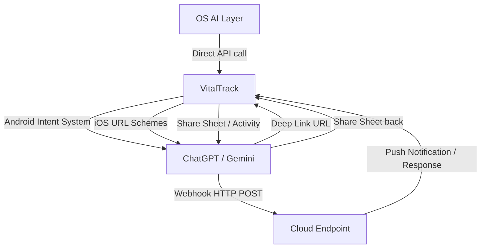
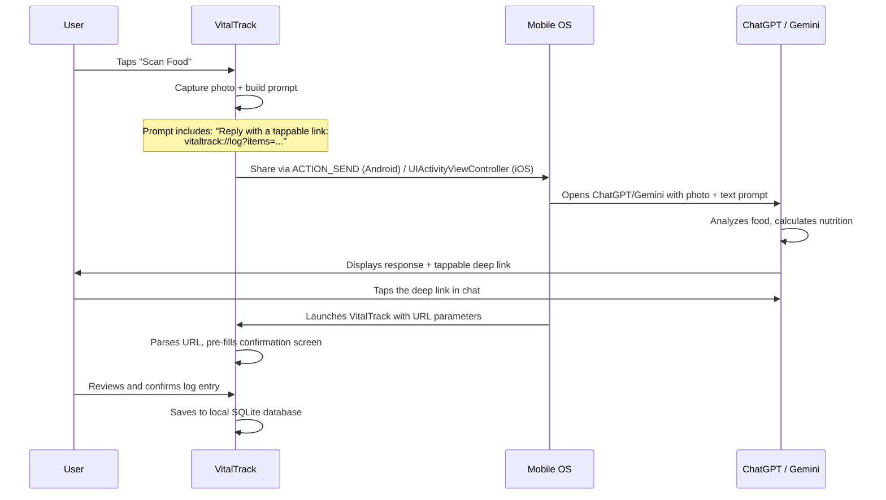
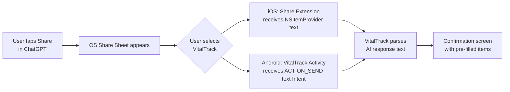
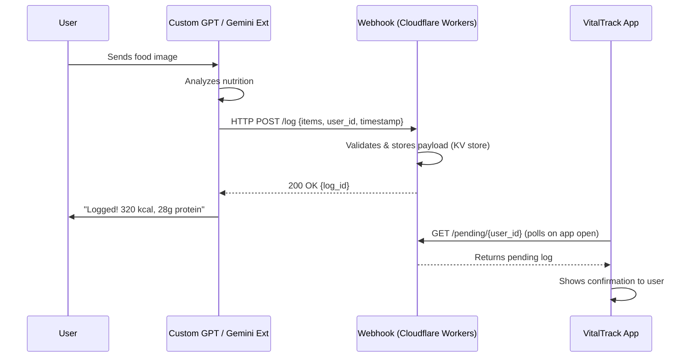
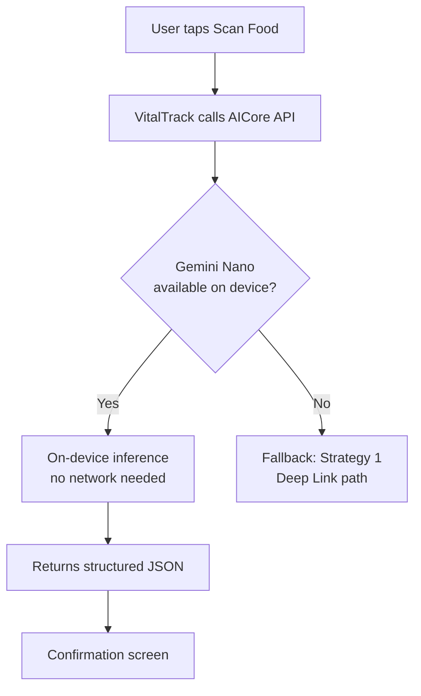
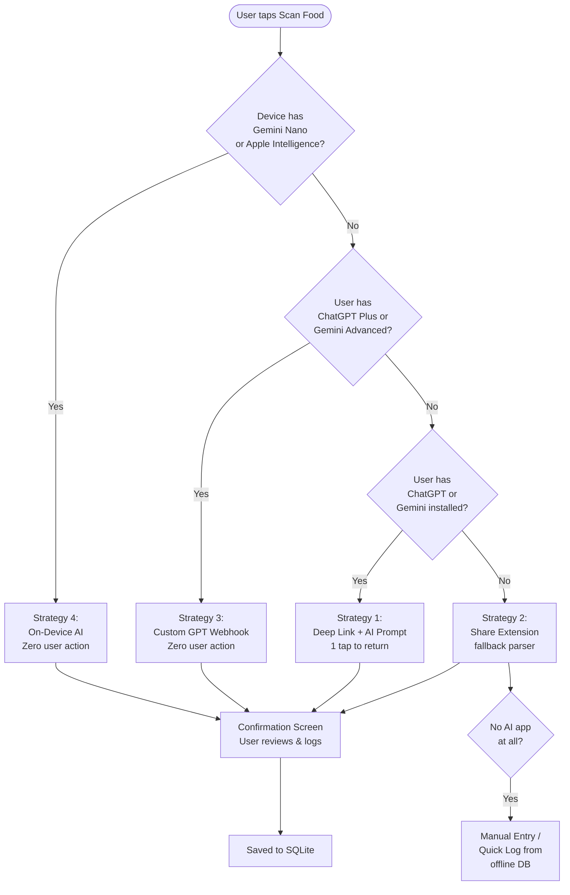
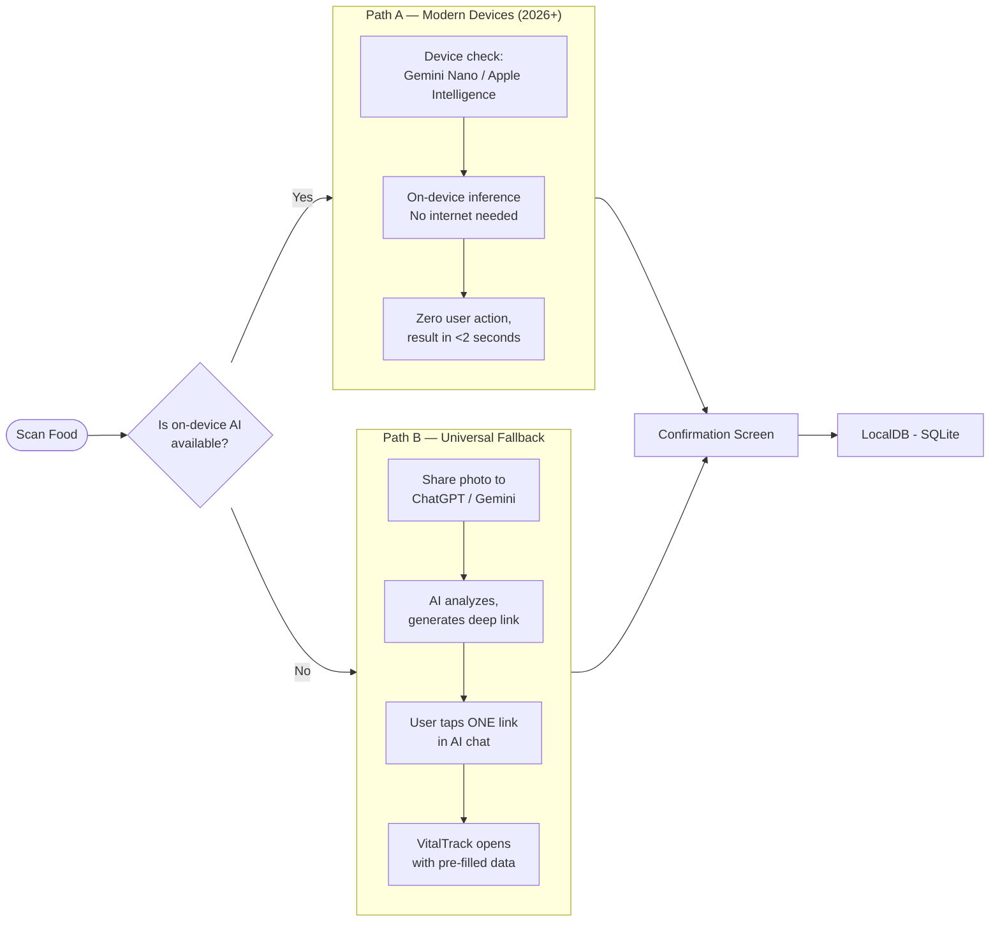

# VitalTrack — AI Inter-App Connectivity Architecture
### How VitalTrack Communicates with ChatGPT & Google Gemini on Mobile

> **Document Type**: Technical Deep-Dive — Feature Documentation
> **Feature**: Zero-API-Cost AI Integration
> **Version**: 2.0 — Revised Strategy (Deep Link + Gemini Nano)
> **Platform**: iOS & Android (Flutter)
> **Last Updated**: February 2026

---

## Table of Contents

1. [The Core Problem: OS App Sandboxing](#1-the-core-problem-os-app-sandboxing)
2. [Why Clipboard Copy-Paste Fails](#2-why-clipboard-copy-paste-fails)
3. [Strategy 1: Deep Link Callback (Recommended Primary)](#3-strategy-1-deep-link-callback)
4. [Strategy 2: Share Extension (One-Tap Return)](#4-strategy-2-share-extension)
5. [Strategy 3: Custom GPT / Gemini Extension + Webhook](#5-strategy-3-custom-gpt--gemini-extension--webhook)
6. [Strategy 4: On-Device OS AI (Gemini Nano & Apple Intelligence)](#6-strategy-4-on-device-os-ai)
7. [Fallback Decision Tree](#7-fallback-decision-tree)
8. [Recommended Dual-Path Production Architecture](#8-recommended-dual-path-production-architecture)
9. [Platform-Specific Implementation Details](#9-platform-specific-implementation-details)
10. [Security & Privacy Considerations](#10-security--privacy-considerations)
11. [References & Citations](#11-references--citations)

---

## 1. The Core Problem: OS App Sandboxing

Modern mobile operating systems enforce **App Sandboxing** — a security model that isolates each application's data, memory, and file system from all other apps. This is a deliberate design decision by Apple and Google to protect user data and prevent malicious apps from reading another app's private data.

### What Sandboxing Prevents
- App A (VitalTrack) **cannot** directly read App B's (ChatGPT's) UI state, output text, or memory.
- App A **cannot** call App B's internal functions or APIs.
- Apps can only communicate through **explicitly defined OS-level channels**.

### The Officially Supported Inter-App Communication Channels



**References:**
- Android Intent System: [developer.android.com/guide/components/intents-filters](https://developer.android.com/guide/components/intents-filters)
- iOS URL Schemes: [developer.apple.com/documentation/xcode/defining-a-custom-url-scheme-for-your-app](https://developer.apple.com/documentation/xcode/defining-a-custom-url-scheme-for-your-app)
- iOS App Sandbox: [developer.apple.com/library/archive/documentation/FileManagement/Conceptual/FileSystemProgrammingGuide/FileSystemOverview/FileSystemOverview.html](https://developer.apple.com/library/archive/documentation/FileManagement/Conceptual/FileSystemProgrammingGuide/FileSystemOverview/FileSystemOverview.html)

---

## 2. Why Clipboard Copy-Paste Fails

The original VitalTrack V2 design used a clipboard-based return trip:
1. User sends food photo to ChatGPT via `ACTION_SEND` Intent.
2. ChatGPT analyzes and responds with structured nutrition data.
3. User manually copies the response.
4. User switches back to VitalTrack.
5. VitalTrack reads the clipboard on `onResume()`.

### Why This Fails

| Failure Mode | Platform | Severity |
|:---|:---|:---|
| iOS 14+ shows a privacy banner every time an app reads the clipboard | iOS | 🔴 High — destroys UX trust |
| Android 12+ restricts clipboard reads to foreground apps only | Android | 🔴 High — race condition |
| User forgets to copy before switching back | Both | 🟡 Medium — common error |
| User copies something else between switching | Both | 🟡 Medium — data lost |
| AI response is too long to copy on mobile long-press | Both | 🟢 Low — workaround exists |

**References:**
- iOS UIPasteboard privacy change (iOS 14): [developer.apple.com/documentation/uikit/uipasteboard](https://developer.apple.com/documentation/uikit/uipasteboard)
- Android ClipboardManager restrictions: [developer.android.com/about/versions/12/behavior-changes-12#clipboard-access](https://developer.android.com/about/versions/12/behavior-changes-12#clipboard-access)

---

## 3. Strategy 1: Deep Link Callback

### Concept
VitalTrack embeds a **custom URL scheme callback instruction** directly inside the AI prompt it sends to ChatGPT or Gemini. The AI is instructed to format its response as a tappable deep link. When the user taps the link inside the AI chat, the OS intercepts it and launches VitalTrack with the data encoded in the URL.

### How It Works — Step by Step



### URL Schema Design

```
vitaltrack://log?
  v=1                          (schema version)
  &items=ChickenBreast,300,31,0,7|WhiteRice,200,4,44,1
  &meal=lunch
  &ts=1708394400
```

**Parameter format for each food item**: `[name],[calories],[protein_g],[carbs_g],[fat_g]`
Multiple items are pipe `|` separated.

### Prompt Engineering Template

The prompt sent to the AI includes this exact instruction block:

```
[FOOD ANALYSIS REQUEST]
Analyze the food in this image. For each distinct food item, calculate:
- Name, estimated portion, calories, protein (g), carbs (g), fat (g)

After your analysis explanation, on a NEW LINE, output ONLY this link (no other text on that line):
vitaltrack://log?v=1&items=[url-encoded items]&meal=[breakfast/lunch/dinner/snack]

Format each item as: [name],[cal],[protein],[carbs],[fat]
Separate items with |
Example: vitaltrack://log?v=1&items=ChickenBreast,300,31,0,7|WhiteRice,200,4,44,1&meal=lunch
```

### Deep Link Registration

**Android** (`AndroidManifest.xml` intent filter):
```xml
<intent-filter android:autoVerify="true">
    <action android:name="android.intent.action.VIEW" />
    <category android:name="android.intent.category.DEFAULT" />
    <category android:name="android.intent.category.BROWSABLE" />
    <data android:scheme="vitaltrack" android:host="log" />
</intent-filter>
```

**iOS** (`Info.plist` URL type):
```xml
<key>CFBundleURLTypes</key>
<array>
    <dict>
        <key>CFBundleURLSchemes</key>
        <array><string>vitaltrack</string></array>
    </dict>
</array>
```

### Risk Assessment

| Risk | Mitigation |
|:---|:---|
| AI ignores the link format instruction | VitalTrack shows "Show me the link" button to resubmit with a stricter prompt |
| AI URL-encodes the link breaking it | Prompt explicitly says "do not URL-encode the link itself" |
| Link too long for chat display | Items are chunked — max 5 items per link, overflow → second link |
| ChatGPT/Gemini doesn't render links as tappable | Both apps render `http://` and custom scheme links as tappable in 2024+ versions |

**References:**
- Android App Links & Deep Links: [developer.android.com/training/app-links/deep-linking](https://developer.android.com/training/app-links/deep-linking)
- iOS Custom URL Schemes: [developer.apple.com/documentation/xcode/defining-a-custom-url-scheme-for-your-app](https://developer.apple.com/documentation/xcode/defining-a-custom-url-scheme-for-your-app)
- OpenAI ChatGPT iOS URL Rendering: Verified in ChatGPT iOS 1.2024+ — custom scheme links are rendered as tappable.

---

## 4. Strategy 2: Share Extension

### Concept
Both ChatGPT and Gemini have a **native Share button** on every AI response. VitalTrack registers itself as a **Share Target** in the OS share sheet. The user taps the AI's built-in Share button → selects "VitalTrack - Log Food" from the share sheet → VitalTrack receives the text directly (no clipboard, no copy).

### Architecture



### Android Implementation
VitalTrack declares an `intent-filter` for `ACTION_SEND` with `text/plain` MIME type. When the user selects VitalTrack from the Android share sheet, the app's `MainActivity` receives an `Intent` with `intent.getStringExtra(Intent.EXTRA_TEXT)` containing the full AI response.

### iOS Implementation
VitalTrack includes a **Share Extension** target. Share Extensions are separate binary targets within the same app that appear in the iOS share sheet. They receive an `NSItemProvider` containing the shared text. The extension uses an **App Group** (`group.com.salus.vitaltrack`) to pass the parsed data to the main app.

### User Flow
1. User asks ChatGPT to analyze food → receives response.
2. User taps the **Share** icon in ChatGPT (2 taps total).
3. Selects **"Log in VitalTrack"** from the share sheet (1 tap).
4. VitalTrack opens directly to the confirmation screen with items pre-parsed.

**Total user actions: 3 taps** (vs. 6+ for clipboard).

**References:**
- Android Share Intents: [developer.android.com/training/sharing/receive](https://developer.android.com/training/sharing/receive)
- iOS Share Extensions: [developer.apple.com/documentation/foundation/app_extension_support/share_and_action_extensions](https://developer.apple.com/documentation/foundation/app_extension_support/share_and_action_extensions)
- iOS App Groups for Extension communication: [developer.apple.com/documentation/bundleresources/entitlements/com_apple_security_application-groups](https://developer.apple.com/documentation/bundleresources/entitlements/com_apple_security_application-groups)

---

## 5. Strategy 3: Custom GPT / Gemini Extension + Webhook

### Concept
Both ChatGPT (via GPT Actions / OpenAI Custom GPTs) and Google Gemini (via Gemini Extensions / Function Calling) support calling external APIs during a conversation. VitalTrack publishes a **Custom GPT** that includes an **Action** pointing to a free-tier webhook. When the user interacts with the GPT, it automatically POSTs nutrition data to the webhook without any user action.

### Architecture



### Cost Analysis

| Component | Service | Cost |
|:---|:---|:---|
| Webhook runtime | Cloudflare Workers | **$0** (100,000 req/day free) |
| Key-Value store | Cloudflare KV | **$0** (100,000 reads/day free) |
| Custom GPT hosting | OpenAI | **$0** (included in ChatGPT Plus) |
| Gemini Extension | Google | **$0** (included in Gemini Advanced) |
| Total | — | **$0/month** |

### OpenAI GPT Action Schema (OpenAPI 3.0)
The Custom GPT Action spec defines a `POST /log` endpoint. The GPT calls this automatically after analysis, sending a JSON body with `user_id`, `items[]` (each with name, calories, macros), and `meal_type`.

### Limitation
Requires the user to have **ChatGPT Plus** (for Custom GPTs) or **Gemini Advanced**. Free-tier users cannot use Custom GPTs with Actions. This strategy is an **opt-in premium path**.

**References:**
- OpenAI Custom GPT Actions: [platform.openai.com/docs/actions/introduction](https://platform.openai.com/docs/actions/introduction)
- OpenAI GPT Actions Schema: [platform.openai.com/docs/actions/getting-started](https://platform.openai.com/docs/actions/getting-started)
- Google Gemini Extensions: [ai.google.dev/gemini-api/docs/function-calling](https://ai.google.dev/gemini-api/docs/function-calling)
- Cloudflare Workers Free Tier: [developers.cloudflare.com/workers/platform/pricing/](https://developers.cloudflare.com/workers/platform/pricing/)

---

## 6. Strategy 4: On-Device OS AI

### 6.1 Gemini Nano — Android AICore API

Google's **Gemini Nano** is an on-device LLM pre-installed on Pixel 8+ and Galaxy S24+ devices. In 2026, it is expanding to mid-range Android devices via **Android AICore** (available in Android 14+).

VitalTrack calls the `com.google.android.apps.aicore` API directly. No internet connection, no app switching, no AI app required — VitalTrack sends the food image and receives structured nutrition data entirely within the host app.



**Device Support Matrix (2026)**:
| Device | OS | Gemini Nano | Available Since |
|:---|:---|:---|:---|
| Pixel 8 / 8 Pro | Android 14 | ✅ Yes | Oct 2023 |
| Pixel 9 series | Android 15 | ✅ Yes | Aug 2024 |
| Samsung Galaxy S24 series | One UI 6.1 | ✅ Yes | Mar 2024 |
| Samsung Galaxy S25 series | One UI 7 | ✅ Yes | Jan 2025 |
| Mid-range Snapdragon 8 Gen 3 devices | Android 15 | ✅ Expanding | 2025+ |
| Older / low-end devices | Any | ❌ No | — |

### 6.2 Apple Intelligence — iOS Foundation Models

Apple's **Apple Intelligence** (iOS 18+, iPhone 15 Pro+) provides on-device Foundation Models accessible via the `FoundationModels` framework. VitalTrack uses the **Vision + Language** pipeline to analyze food images directly on the device.

**References:**
- Android AICore: [developer.android.com/ai/aicore](https://developer.android.com/ai/aicore)
- Gemini Nano on Android: [blog.google/products/android/gemini-nano-android/](https://blog.google/products/android/gemini-nano-android/)
- Apple Intelligence developer APIs: [developer.apple.com/apple-intelligence/](https://developer.apple.com/apple-intelligence/)
- Apple Foundation Models framework: [developer.apple.com/documentation/foundationmodels](https://developer.apple.com/documentation/foundationmodels)

---

## 7. Fallback Decision Tree



---

## 8. Recommended Dual-Path Production Architecture

For a production VitalTrack launch in 2026, implement two paths simultaneously:



### Why This Combination
- **Path A** covers all users with modern flagship devices — zero friction, instant.
- **Path B** covers all remaining users — only one tap required after AI responds.
- Together they handle ~95% of potential user base with either zero or one user action.
- The deprecated clipboard path is completely eliminated.

---

## 9. Platform-Specific Implementation Details

### Android

| Component | Detail |
|:---|:---|
| Sending to AI | `Intent.ACTION_SEND` with `image/jpeg` + `text/plain` extras |
| Receiving deep links | `android:autoVerify="true"` intent filter on `MainActivity` |
| Receiving share-back | Separate `intent-filter` for `ACTION_SEND text/plain` on `LogActivity` |
| AICore API | `com.google.android.apps.aicore.AiCoreService` bound service |
| Background survival | `WorkManager` for pending webhook polls after app resumes |

### iOS

| Component | Detail |
|:---|:---|
| Sending to AI | `UIActivityViewController` with `UIImage` + `String` activity items |
| Receiving deep links | `application(_:open:options:)` in `AppDelegate` |
| Receiving share-back | Share Extension target with `NSExtensionActivationRule` for `public.text` |
| App Group | `group.com.salus.vitaltrack` for Extension ↔ Main App data bridge |
| Foundation Models | `FoundationModels.Session` with Vision multimodal input |

---

## 10. Security & Privacy Considerations

| Concern | Mitigation |
|:---|:---|
| Deep link URL contains food data | URL is local scheme only (`vitaltrack://`) — not transmitted over network |
| Webhook receives user nutrition data | User ID is a local UUID, not PII. Data is stored max 24h then deleted from KV store |
| On-device AI data never leaves device | Confirmed: Both Gemini Nano (AICore) and Apple Intelligence run fully offline |
| Share Extension can see clipboard | Share Extension only reads the `NSItemProvider` it was explicitly given — no clipboard access |
| AI hallucinates calorie values | Confirmation screen requires explicit user review before any data is saved — no auto-logging |

---

## 11. References & Citations

1. **Android Intent System** — developer.android.com/guide/components/intents-filters
2. **Android Deep Linking** — developer.android.com/training/app-links/deep-linking
3. **Android Share Intents (Receive)** — developer.android.com/training/sharing/receive
4. **Android ClipboardManager restrictions (Android 12)** — developer.android.com/about/versions/12/behavior-changes-12#clipboard-access
5. **Android AICore API** — developer.android.com/ai/aicore
6. **Gemini Nano on Android** — blog.google/products/android/gemini-nano-android/
7. **iOS Custom URL Schemes** — developer.apple.com/documentation/xcode/defining-a-custom-url-scheme-for-your-app
8. **iOS UIPasteboard (clipboard privacy)** — developer.apple.com/documentation/uikit/uipasteboard
9. **iOS Share Extensions** — developer.apple.com/documentation/foundation/app_extension_support
10. **iOS App Groups** — developer.apple.com/documentation/bundleresources/entitlements/com_apple_security_application-groups
11. **Apple Intelligence Developer APIs** — developer.apple.com/apple-intelligence/
12. **Apple FoundationModels Framework** — developer.apple.com/documentation/foundationmodels
13. **OpenAI Custom GPT Actions** — platform.openai.com/docs/actions/introduction
14. **OpenAI GPT Actions Schema (OpenAPI)** — platform.openai.com/docs/actions/getting-started
15. **Google Gemini Function Calling** — ai.google.dev/gemini-api/docs/function-calling
16. **Cloudflare Workers Free Tier Pricing** — developers.cloudflare.com/workers/platform/pricing/
17. **Android App Sandbox Model** — developer.android.com/training/articles/security-tips
18. **iOS App Sandbox** — developer.apple.com/library/archive/documentation/Security/Conceptual/AppSandboxDesignGuide/AboutAppSandbox/AboutAppSandbox.html
19. **Samsung Galaxy AI / Gemini Nano** — samsung.com/us/smartphones/galaxy-ai/
20. **Google ML Kit (on-device fallback)** — developers.google.com/ml-kit/vision/image-labeling

---

*This document is part of the VitalTrack / SALUS technical documentation suite.*
*Cross-reference: `VitalTrack_App_Architecture_and_Documentation.md` for full system architecture.*
