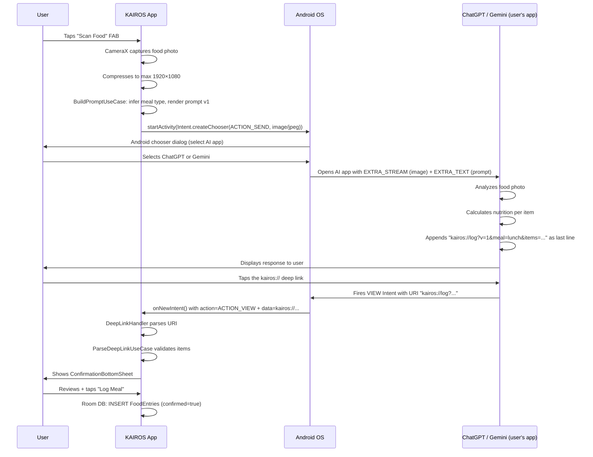
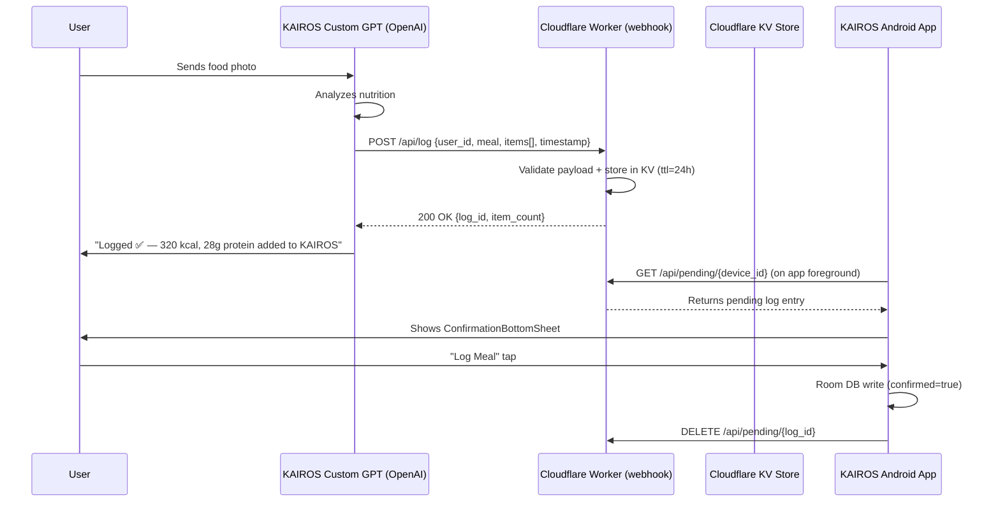
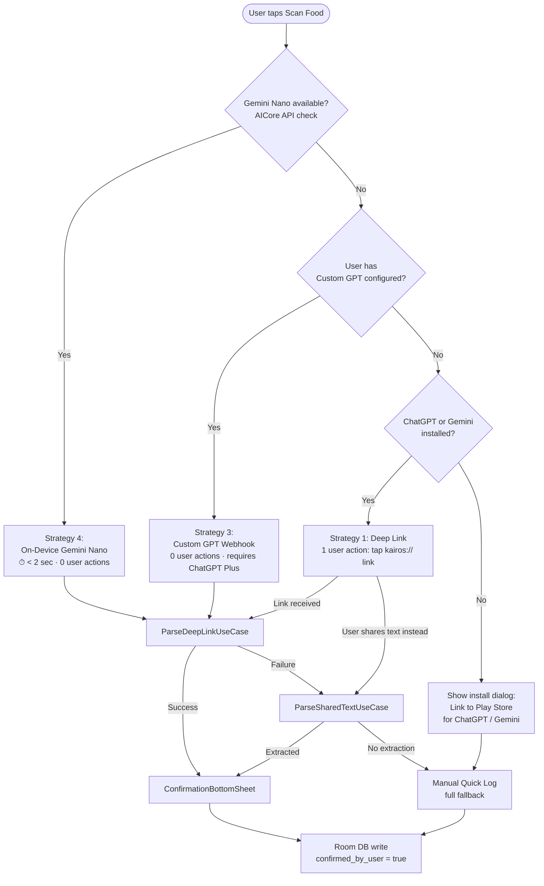
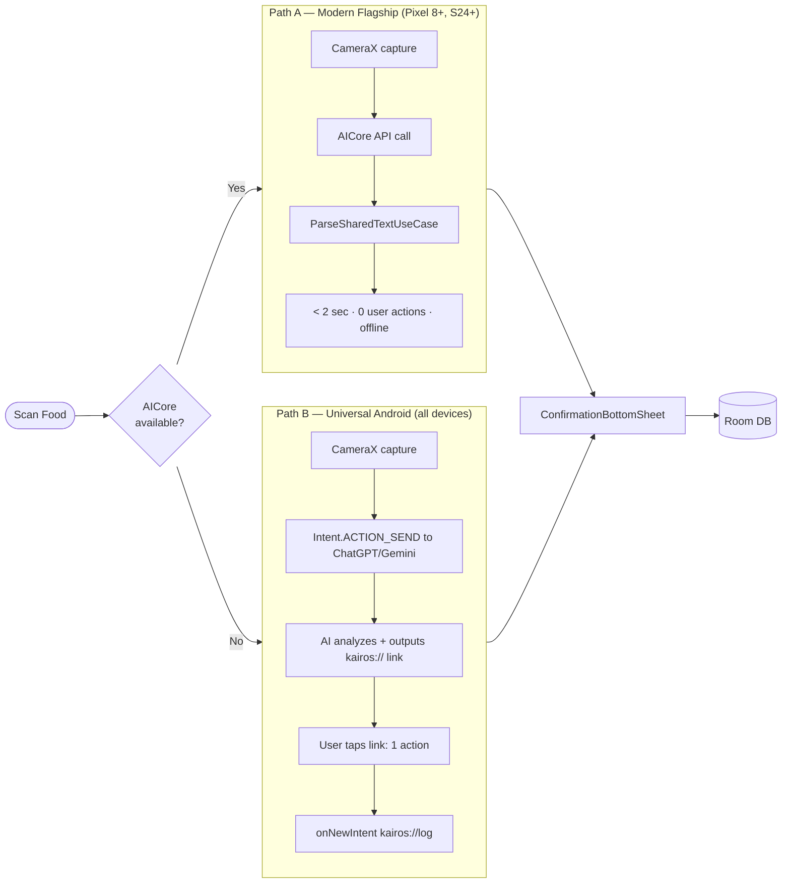

# KAIROS — Android AI Inter-App Connectivity
## Technical Deep-Dive: Zero-API-Cost AI Integration on Android

---

> **App Name**: KAIROS
> **Platform**: Android only (API 26+ min · API 35 target)
> **Language**: Kotlin · **UI Framework**: Jetpack Compose
> **Document Type**: Feature Architecture — AI Inter-App Communication
> **Version**: 3.0
> **Audience**: Android Engineering Team
> **Last Updated**: February 2026

---

## Table of Contents

1. [The Problem: App Sandboxing on Android](#1-the-problem-app-sandboxing-on-android)
2. [Strategy 1: Deep Link Callback (Primary Path)](#2-strategy-1-deep-link-callback-primary-path)
3. [Strategy 2: Share Target Receiver (Fallback Path)](#3-strategy-2-share-target-receiver-fallback-path)
4. [Strategy 3: Custom GPT with Webhook API](#4-strategy-3-custom-gpt-with-webhook-api)
5. [Strategy 4: On-Device AI — Gemini Nano via AICore](#5-strategy-4-on-device-ai--gemini-nano-via-aicore)
6. [Fallback Decision Tree & Routing Logic](#6-fallback-decision-tree--routing-logic)
7. [Full Production Architecture — Dual-Path](#7-full-production-architecture--dual-path)
8. [Android-Specific Implementation Details](#8-android-specific-implementation-details)
9. [Security & Privacy on Android](#9-security--privacy-on-android)
10. [Testing the Inter-App Flow](#10-testing-the-inter-app-flow)
11. [References](#11-references)

---

## 1. The Problem: App Sandboxing on Android

Android enforces **application sandboxing** — each APK runs in its own Linux user ID and process. This prevents:
- App A (KAIROS) from directly reading App B's (ChatGPT's) memory, SQLite database, or UI state.
- App A from calling App B's internal methods or accessing its private files.
- Any cross-process data sharing without an explicit, declared Android IPC mechanism.

### The Android IPC Channels KAIROS Uses

Android provides several sanctioned mechanisms for inter-app communication. KAIROS uses:

| Mechanism | API | KAIROS Usage |
|:---|:---|:---|
| **Intent system** (`ACTION_SEND`) | `android.content.Intent` | Forward: KAIROS → ChatGPT/Gemini with photo + prompt |
| **Intent system** (`ACTION_VIEW`) | `android.content.Intent` | Return: Deep link `kairos://log?...` tapped in AI app |
| **Share Target** (`ACTION_SEND text/plain`) | `android.content.Intent` | Return: User shares AI response text back to KAIROS |
| **Android AICore API** | `com.google.android.apps.aicore` | On-device Gemini Nano — no external app needed |
| **Custom GPT Action webhook** | HTTP POST | Automated: AI POSTs directly to KAIROS webhook |

**References:**
- Android Intent System: [developer.android.com/guide/components/intents-filters](https://developer.android.com/guide/components/intents-filters)
- Android Application Sandbox: [developer.android.com/training/articles/security-tips#Sandbox](https://developer.android.com/training/articles/security-tips#Sandbox)

---

## 2. Strategy 1: Deep Link Callback (Primary Path)

### 2.1 Concept

KAIROS embeds a **custom URL scheme instruction** inside the prompt it sends to ChatGPT or Gemini. The AI is instructed to format its structured response as a `kairos://` deep link as the last line of its reply. When the user taps the link inside the AI chat app, Android routes the `kairos://` scheme to KAIROS via the Intent system.

**This requires exactly ONE user action** (tap the link) after the AI responds. No copy-paste. No clipboard.

### 2.2 Complete Flow



### 2.3 Deep Link URI Schema

```
kairos://log
  ?v=[version]
  &meal=[meal_type]
  &items=[item_list]
```

**Parameters:**

| Parameter | Type | Values | Example |
|:---|:---|:---|:---|
| `v` | Int | `1` (current schema version) | `v=1` |
| `meal` | Enum | `breakfast \| lunch \| dinner \| snack` | `meal=lunch` |
| `items` | String | Pipe-separated item tuples | See below |

**Item tuple format**: `[name],[calories],[protein_g],[carbs_g],[fat_g]`

Names must be URL-safe (no spaces, no commas — use CamelCase). Multiple items separated by `|`.

**Full example:**
```
kairos://log?v=1&meal=lunch&items=GrilledChicken,310,32,0,7|WhiteRice,220,4,46,1|Cucumber,16,0,3,0
```

### 2.4 Prompt Template (v1)

The prompt is injected into `Intent.EXTRA_TEXT` alongside the food image. It must be precise — the AI's willingness to follow format instructions determines the reliability of the deep link return.

```
══════════════════════════════════════════════════════════
FOOD ANALYSIS REQUEST — KAIROS Nutrition Tracker
══════════════════════════════════════════════════════════

You are a precision nutrition analyst. Analyze the food in the attached image.

For EACH distinct food item:
1. Identify: specific name, estimated portion (weight in g)
2. Calculate: calories (kcal), protein (g), carbohydrates (g), fat (g)

Explain your reasoning for each item, then on a COMPLETELY NEW LINE,
output ONLY the following link with NO other characters on that line:

kairos://log?v=1&meal=[MEAL_TYPE]&items=[ITEM_1]|[ITEM_2]...

Where each [ITEM] = [CamelCaseName],[cal],[prot],[carb],[fat]
Example: GrilledChicken,310,32,0,7|WhiteRice,220,4,46,1

RULES:
- Use CamelCase for food names (no spaces, no commas within a name)
- Integers only for calories; one decimal max for macros
- Today's meal: [MEAL_TYPE]  ← replaced at runtime
- Do NOT URL-encode the link
- Do NOT add markdown formatting (no backticks, no asterisks) to the link line

══════════════════════════════════════════════════════════
```

**Runtime substitution** in `BuildPromptUseCase.kt`:
```kotlin
fun invoke(captureTime: Instant): String {
    val mealType = inferMealType(captureTime)
    return PROMPT_TEMPLATE_V1.replace("[MEAL_TYPE]", mealType.apiValue)
}

private fun inferMealType(time: Instant): MealType {
    val hour = time.atZone(ZoneId.systemDefault()).hour
    return when (hour) {
        in 5..10 -> MealType.BREAKFAST
        in 11..14 -> MealType.LUNCH
        in 15..20 -> MealType.DINNER
        else -> MealType.SNACK
    }
}
```

### 2.5 AndroidManifest.xml — Deep Link Registration

```xml
<activity
    android:name=".MainActivity"
    android:launchMode="singleTask"
    android:exported="true">

    <!-- Launcher -->
    <intent-filter>
        <action android:name="android.intent.action.MAIN" />
        <category android:name="android.intent.category.LAUNCHER" />
    </intent-filter>

    <!-- Strategy 1: deep link kairos://log -->
    <intent-filter>
        <action android:name="android.intent.action.VIEW" />
        <category android:name="android.intent.category.DEFAULT" />
        <category android:name="android.intent.category.BROWSABLE" />
        <data
            android:scheme="kairos"
            android:host="log" />
    </intent-filter>

</activity>
```

> **Note on `android:launchMode="singleTask"`**: This ensures that when the deep link fires, Android brings the existing KAIROS task to the foreground and routes to `onNewIntent()`, rather than creating a duplicate `MainActivity` instance. Critical for correct deep link handling.

### 2.6 Deep Link Handling in MainActivity

```kotlin
class MainActivity : ComponentActivity() {

    private lateinit var navController: NavHostController

    override fun onCreate(savedInstanceState: Bundle?) {
        super.onCreate(savedInstanceState)
        setContent {
            navController = rememberNavController()
            KairosTheme {
                KairosNavHost(navController = navController)
            }
        }
        // Handle cold start deep link
        intent?.let { handleIncomingIntent(it) }
    }

    // Called when app is already running and deep link fires
    override fun onNewIntent(intent: Intent) {
        super.onNewIntent(intent)
        setIntent(intent)
        handleIncomingIntent(intent)
    }

    private fun handleIncomingIntent(intent: Intent) {
        when {
            intent.action == Intent.ACTION_VIEW &&
            intent.data?.scheme == "kairos" &&
            intent.data?.host == "log" -> {
                val uri = intent.data?.toString() ?: return
                // Navigate to confirmation screen
                navController.navigate(
                    Screen.Confirmation.createRoute(
                        encodedUri = Uri.encode(uri)
                    )
                )
            }
            intent.action == Intent.ACTION_SEND &&
            intent.type == "text/plain" -> {
                // Strategy 2 entry point
                val sharedText = intent.getStringExtra(Intent.EXTRA_TEXT) ?: return
                navController.navigate(
                    Screen.SharedText.createRoute(
                        encodedText = Uri.encode(sharedText)
                    )
                )
            }
        }
    }
}
```

### 2.7 ParseDeepLinkUseCase

```kotlin
class ParseDeepLinkUseCase @Inject constructor() {

    operator fun invoke(rawUri: String): ParseResult {
        return try {
            val uri = Uri.parse(rawUri)
            val version = uri.getQueryParameter("v")?.toIntOrNull() ?: 1
            val meal = MealType.fromApi(uri.getQueryParameter("meal")) ?: MealType.SNACK
            val itemsRaw = uri.getQueryParameter("items") ?: return ParseResult.Failure("No items")

            val items = itemsRaw.split("|").map { itemStr ->
                val parts = itemStr.split(",")
                if (parts.size != 5) throw IllegalArgumentException("Malformed item: $itemStr")
                ParsedFoodItem(
                    name       = parts[0].trim().take(80).ifBlank { throw IllegalArgumentException("Empty name") },
                    calories   = parts[1].toInt().also { require(it in 0..5000) { "Calorie out of range" } },
                    proteinG   = parts[2].toFloat().also { require(it in 0f..500f) },
                    carbsG     = parts[3].toFloat().also { require(it in 0f..500f) },
                    fatG       = parts[4].toFloat().also { require(it in 0f..500f) },
                    needsReview = parts[1].toInt() > 2000
                )
            }
            ParseResult.Success(meal = meal, items = items, schemaVersion = version)
        } catch (e: Exception) {
            ParseResult.Failure(reason = e.message ?: "Unknown parse error")
        }
    }
}

sealed class ParseResult {
    data class Success(
        val meal: MealType,
        val items: List<ParsedFoodItem>,
        val schemaVersion: Int
    ) : ParseResult()
    data class Failure(val reason: String) : ParseResult()
}
```

### 2.8 Risk Mitigation

| Risk | Handling |
|:---|:---|
| AI formats link incorrectly (extra text, markdown wrap) | Regex fallback: extract first match of `kairos://log\?[^\s\n]+` from full response text |
| Link is too long (>10 items) | Prompt instructs max 8 items per link; overflow: generate second link on next line |
| Android chooser shows no relevant AI app | Check `PackageManager` before showing chooser; show install prompt if neither app found |
| KAIROS killed by OEM before deep link fires | `WorkManager KEEP` : `PendingParseWorker` survives process death; `onResume()` calls `WorkManager.getPendingWork()` |

---

## 3. Strategy 2: Share Target Receiver (Fallback Path)

### 3.1 Concept

Both ChatGPT and Gemini Android apps show a **Share** button on every AI response message. KAIROS registers itself as a `text/plain` share target in `AndroidManifest.xml`. The user taps Share in the AI app → selects "KAIROS" → KAIROS receives the full AI response text via `Intent.EXTRA_TEXT`.

**User actions required: 2** (Share button tap + select KAIROS from sheet).

### 3.2 Manifest Registration

```xml
<!-- In MainActivity intent-filter block (already shown in Strategy 1) -->
<intent-filter>
    <action android:name="android.intent.action.SEND" />
    <category android:name="android.intent.category.DEFAULT" />
    <data android:mimeType="text/plain" />
</intent-filter>
```

### 3.3 Received Text Parsing

When KAIROS receives shared text, `ParseSharedTextUseCase` runs two extraction stages:

**Stage 1: Deep link extraction (preferred)**
```kotlin
val deepLinkRegex = Regex("""kairos://log\?[^\s\n\r""'<>]+""")
val match = deepLinkRegex.find(sharedText)
if (match != null) return parseDeepLink(match.value)  // → Strategy 1 parser
```

**Stage 2: NLP pattern extraction (fallback)**
If no deep link is present (AI ignored the format instruction), apply heuristic extraction:
```kotlin
// Matches: "Grilled Chicken - 310 kcal | Protein: 32g | Carbs: 0g | Fat: 7g"
val linePattern = Regex(
    """([\w\s]+)\s*[:\-–]\s*(\d+)\s*kcal.*?[Pp]rotein[:\s]+(\d+\.?\d*)g.*?[Cc]arb[s]?[:\s]+(\d+\.?\d*)g.*?[Ff]at[:\s]+(\d+\.?\d*)g""",
    RegexOption.DOT_MATCHES_ALL
)
```
If Stage 2 matches, items are returned with `source = NEEDS_REVIEW`. The confirmation UI marks each item with a ⚠️ and prompts the user to verify values.

If neither stage produces data, KAIROS shows a text field pre-filled with the raw AI response and asks the user to log manually.

---

## 4. Strategy 3: Custom GPT with Webhook API

### 4.1 Concept

OpenAI's **Custom GPT** platform supports **GPT Actions** — a mechanism where a GPT can call external HTTP APIs during a conversation. KAIROS creates a published Custom GPT with an Action that POSTs structured nutrition data to a **Cloudflare Workers webhook** automatically, without any user action.

**User actions required: 0** — the AI posts the data while the user is reading the response.

### 4.2 Architecture



### 4.3 Cloudflare Workers Webhook

**Route**: `POST https://kairos-webhook.workers.dev/api/log`

**Request body** (JSON):
```json
{
  "device_id": "local-uuid-v4",
  "meal": "lunch",
  "timestamp": 1708394400,
  "items": [
    { "name": "GrilledChicken", "cal": 310, "prot": 32.0, "carb": 0.0, "fat": 7.0 },
    { "name": "WhiteRice", "cal": 220, "prot": 4.0, "carb": 46.0, "fat": 1.0 }
  ]
}
```

**KAIROS polls** `GET /api/pending/{device_id}` on every `onResume()` with a `WorkManager` `OneTimeWorkRequest`.

### 4.4 Cost Analysis

| Component | Service | Free Tier | Cost |
|:---|:---|:---|:---|
| Webhook runtime | Cloudflare Workers | 100,000 req/day | **$0** |
| Key-Value storage | Cloudflare KV | 100,000 reads/day · 1,000 writes/day | **$0** |
| Custom GPT hosting | OpenAI | Included in ChatGPT Plus ($20/mo user) | **$0** to KAIROS |
| **Total** | — | — | **$0/month** |

### 4.5 Limitation

Requires the user to have **ChatGPT Plus** subscription for Custom GPT access with Actions. Free users cannot trigger GPT Actions. This strategy is offered as an **opt-in premium feature** registered in user profile (`preferredAiApp = "custom_gpt"`).

**Reference**: [platform.openai.com/docs/actions/introduction](https://platform.openai.com/docs/actions/introduction)

---

## 5. Strategy 4: On-Device AI — Gemini Nano via AICore

### 5.1 Overview

Google provides **Gemini Nano** — a compressed on-device LLM pre-installed on Android 14+ flagship devices. KAIROS accesses it through the **Android AICore API** (`com.google.android.apps.aicore`), available as a system service on supported hardware.

- **No internet connection required**
- **No external app required**
- **No user action required beyond camera capture**
- **Response in < 2 seconds** on supported hardware

### 5.2 Device Support Matrix

| Device | Android Version | AICore | Status |
|:---|:---|:---|:---|
| Google Pixel 8 / 8 Pro | Android 14 | ✅ | Shipping |
| Google Pixel 9 / 9 Pro | Android 15 | ✅ | Shipping |
| Samsung Galaxy S24 series | One UI 6.1 (Android 14) | ✅ | Shipping |
| Samsung Galaxy S25 series | One UI 7 (Android 15) | ✅ | Shipping |
| Snapdragon 8 Gen 3 devices | Android 15 | ✅ Expanding | 2025/2026 |
| Google Pixel 7 / 7a | Android 14 | ❌ | Not supported |
| All others | Any | ❌ | Not supported |

### 5.3 Build Configuration

```kotlin
// feature-camera/build.gradle.kts
dependencies {
    // AICore is gated by runtime availability check — safe to include for all builds
    implementation("com.google.ai.edge.aicore:aicore:0.0.1-exp01")
}
```

### 5.4 Runtime Availability Check

```kotlin
@Singleton
class AICoreAvailabilityChecker @Inject constructor(
    @ApplicationContext private val context: Context
) {
    suspend fun isAvailable(): Boolean = withContext(Dispatchers.IO) {
        try {
            val config = DownloadConfig.builder()
                .addClientContent("multimodal-food-analysis")
                .build()
            GenerativeModel.isAvailable(context, config)
        } catch (e: Exception) {
            Timber.w(e, "AICore not available on this device")
            false
        }
    }
}
```

### 5.5 AICore Invocation in CameraViewModel

```kotlin
class CameraViewModel @Inject constructor(
    private val aiCoreChecker: AICoreAvailabilityChecker,
    private val shareService: ShareService,
    private val buildPromptUseCase: BuildPromptUseCase
) : ViewModel() {

    fun onPhotoCaptured(imageFile: File) {
        viewModelScope.launch {
            if (aiCoreChecker.isAvailable()) {
                analyzeWithAICore(imageFile)
            } else {
                shareToExternalAI(imageFile)
            }
        }
    }

    private suspend fun analyzeWithAICore(imageFile: File) {
        try {
            val model = GenerativeModel(
                context = context,
                config = GenerationConfig.builder().build()
            )
            val bitmap = BitmapFactory.decodeFile(imageFile.absolutePath)
            val prompt = buildPromptUseCase(Instant.now())
            val response = model.generateContent(
                content {
                    image(bitmap)
                    text(prompt)
                }
            )
            // Parse response text directly (same as Strategy 2 NLP parser)
            val result = parseSharedTextUseCase(response.text ?: "")
            _uiState.update { it.copy(parseResult = result) }
        } catch (e: Exception) {
            // AICore failed — fall back to external AI
            shareToExternalAI(imageFile)
        }
    }

    private fun shareToExternalAI(imageFile: File) {
        shareService.shareToAI(imageFile, buildPromptUseCase(Instant.now()))
    }
}
```

---

## 6. Fallback Decision Tree & Routing Logic



### 6.1 RoutingUseCase Implementation

```kotlin
class DetermineAIRouteUseCase @Inject constructor(
    private val aiCoreChecker: AICoreAvailabilityChecker,
    private val userPrefsRepository: UserPrefsRepository,
    @ApplicationContext private val context: Context
) {
    suspend fun invoke(): AIRoute {
        // Tier 1: On-device AI
        if (aiCoreChecker.isAvailable()) return AIRoute.ON_DEVICE

        // Tier 2: Custom GPT (premium)
        val prefs = userPrefsRepository.get()
        if (prefs.preferredAiApp == "custom_gpt" && isCustomGPTEnabled()) return AIRoute.CUSTOM_GPT

        // Tier 3: External AI app via Intent
        val hasChatGPT = context.isPackageInstalled("com.openai.chatgpt")
        val hasGemini  = context.isPackageInstalled("com.google.android.apps.bard")
        if (hasChatGPT || hasGemini) return AIRoute.EXTERNAL_APP

        // Tier 4: Manual
        return AIRoute.MANUAL
    }
}

fun Context.isPackageInstalled(packageName: String): Boolean = try {
    packageManager.getPackageInfo(packageName, 0)
    true
} catch (e: PackageManager.NameNotFoundException) { false }

enum class AIRoute { ON_DEVICE, CUSTOM_GPT, EXTERNAL_APP, MANUAL }
```

---

## 7. Full Production Architecture — Dual-Path

The recommended production deployment runs **Path A** (Gemini Nano) and **Path B** (External AI + Deep Link) in parallel, with automatic routing.



**User action counts**:
- Path A (flagship): **0 extra actions** — tap shutter → confirmation appears.
- Path B (universal): **1 extra action** — tap the AI response deep link.

---

## 8. Android-Specific Implementation Details

### 8.1 FileProvider Configuration

Required to securely share `image/jpeg` from app-private storage to external apps:

**`res/xml/file_paths.xml`:**
```xml
<?xml version="1.0" encoding="utf-8"?>
<paths>
    <cache-path name="food_photos" path="food_captures/" />
</paths>
```

**`AndroidManifest.xml`:**
```xml
<provider
    android:name="androidx.core.content.FileProvider"
    android:authorities="${applicationId}.fileprovider"
    android:grantUriPermissions="true"
    android:exported="false">
    <meta-data
        android:name="android.support.FILE_PROVIDER_PATHS"
        android:resource="@xml/file_paths" />
</provider>
```

**`ShareService.kt`:**
```kotlin
class ShareService @Inject constructor(
    @ApplicationContext private val context: Context
) {
    fun shareToAI(imageFile: File, prompt: String) {
        val imageUri: Uri = FileProvider.getUriForFile(
            context,
            "${context.packageName}.fileprovider",
            imageFile
        )
        val sendIntent = Intent(Intent.ACTION_SEND).apply {
            type = "image/jpeg"
            putExtra(Intent.EXTRA_STREAM, imageUri)
            putExtra(Intent.EXTRA_TEXT, prompt)
            addFlags(Intent.FLAG_GRANT_READ_URI_PERMISSION)
            addFlags(Intent.FLAG_ACTIVITY_NEW_TASK)
        }
        context.startActivity(
            Intent.createChooser(sendIntent, context.getString(R.string.chooser_title_ai))
                .addFlags(Intent.FLAG_ACTIVITY_NEW_TASK)
        )
    }
}
```

### 8.2 OEM Background Kill Mitigation

Samsung, Xiaomi, Oppo, and other OEMs aggressively kill background apps. KAIROS uses `WorkManager` to survive process death between sending to the AI app and receiving the deep link back.

**`PendingParseWorker.kt`:**
```kotlin
class PendingParseWorker(
    context: Context,
    params: WorkerParameters
) : CoroutineWorker(context, params) {

    override suspend fun doWork(): Result {
        val pendingUri = inputData.getString(KEY_PENDING_URI) ?: return Result.failure()
        // Store in DataStore for pickup on next app launch
        pendingLogDataStore.savePendingUri(pendingUri)
        return Result.success()
    }

    companion object {
        const val KEY_PENDING_URI = "pending_uri"

        fun enqueue(context: Context, rawUri: String) {
            val data = workDataOf(KEY_PENDING_URI to rawUri)
            val request = OneTimeWorkRequestBuilder<PendingParseWorker>()
                .setInputData(data)
                .setExpedited(OutOfQuotaPolicy.RUN_AS_NON_EXPEDITED_WORK_REQUEST)
                .build()
            WorkManager.getInstance(context).enqueueUniqueWork(
                "pending_parse",
                ExistingWorkPolicy.KEEP,
                request
            )
        }
    }
}
```

**In `onResume()` of `MainActivity`:**
```kotlin
lifecycleScope.launch {
    val pendingUri = pendingLogDataStore.getPendingUri()
    if (pendingUri != null) {
        pendingLogDataStore.clearPendingUri()
        navController.navigate(Screen.Confirmation.createRoute(Uri.encode(pendingUri)))
    }
}
```

### 8.3 Checking AI App Installation

```kotlin
// Called during onboarding and before each share action
fun detectAvailableAIApps(context: Context): AIAppAvailability {
    return AIAppAvailability(
        hasChatGPT = context.isPackageInstalled("com.openai.chatgpt"),
        hasGemini  = context.isPackageInstalled("com.google.android.apps.bard")
    )
}

data class AIAppAvailability(
    val hasChatGPT: Boolean,
    val hasGemini: Boolean
) {
    val hasAnyApp: Boolean get() = hasChatGPT || hasGemini
}
```

If `!hasAnyApp`, FAB shows a badge and an inline install prompt:
```kotlin
if (!availability.hasAnyApp) {
    showInstallDialog(
        chatGptPlayUrl = "https://play.google.com/store/apps/details?id=com.openai.chatgpt",
        geminiPlayUrl  = "https://play.google.com/store/apps/details?id=com.google.android.apps.bard"
    )
}
```

---

## 9. Security & Privacy on Android

| Concern | Android Implementation | Notes |
|:---|:---|:---|
| Image file shared with external app | `FileProvider` URI with `FLAG_GRANT_READ_URI_PERMISSION` | Permission auto-revoked after Intent completes |
| Deep link spoofing | Scheme is `kairos://` — no external service registers the same scheme | Low risk on Android (no App Attestation for custom schemes) |
| Webhook user identifier | Local `UUID.randomUUID()` stored in `DataStore<Preferences>` — no email/phone | UUID reset-able by user from Settings screen |
| Webhook data retention | Cloudflare KV entry TTL = 24 hours; deleted after app polls | No permanent storage of food logs on server |
| On-device AI data | Gemini Nano / AICore processes data entirely on-device | Confirmed by Google Android documentation |
| Room DB encryption | SQLCipher AES-256 · key in Android Keystore hardware module | Use `StrongBoxBacked` key generation where chipset supports it |
| No `INTERNET` permission (V3) | Omit from manifest entirely | Webhook polling added in V4 only. V3 is 100% offline |
| `aiRawResponse` retention | Stored in `FoodEntryEntity.aiRawResponse` · `PurgeOldResponsesWorker` deletes after 30 days | Needed for re-parsing if parser bug is fixed |

---

## 10. Testing the Inter-App Flow

### 10.1 Unit Tests — ParseDeepLinkUseCase

```kotlin
class ParseDeepLinkUseCaseTest {

    private val useCase = ParseDeepLinkUseCase()

    @Test
    fun `valid uri with two items returns success`() {
        val uri = "kairos://log?v=1&meal=lunch&items=Chicken,310,32,0,7|Rice,220,4,46,1"
        val result = useCase(uri) as ParseResult.Success
        assertEquals(2, result.items.size)
        assertEquals(310, result.items[0].calories)
        assertEquals(MealType.LUNCH, result.meal)
    }

    @Test
    fun `item with calorie over 2000 sets needsReview flag`() {
        val uri = "kairos://log?v=1&meal=dinner&items=GiantPizza,2500,80,300,100"
        val result = useCase(uri) as ParseResult.Success
        assertTrue(result.items[0].needsReview)
    }

    @Test
    fun `malformed item count returns failure`() {
        val uri = "kairos://log?v=1&meal=lunch&items=BrokenItem,300,31"
        assertIs<ParseResult.Failure>(useCase(uri))
    }

    @Test
    fun `empty name returns failure`() {
        val uri = "kairos://log?v=1&meal=lunch&items=,300,31,0,7"
        assertIs<ParseResult.Failure>(useCase(uri))
    }

    @Test
    fun `out of range calories returns failure`() {
        val uri = "kairos://log?v=1&meal=snack&items=Cookie,9999,5,50,30"
        assertIs<ParseResult.Failure>(useCase(uri))
    }
}
```

### 10.2 Integration Test — Deep Link → Room Write

```kotlin
@HiltAndroidTest
class DeepLinkIntegrationTest {

    @get:Rule val hiltRule = HiltAndroidRule(this)

    @Inject lateinit var navController: TestNavHostController
    @Inject lateinit var foodLogRepository: FoodLogRepository

    @Test
    fun `deep link intent results in saved food entry after confirmation`() = runTest {
        // Simulate deep link arrival
        val uri = "kairos://log?v=1&meal=lunch&items=Salad,120,3,15,5"
        val intent = Intent(Intent.ACTION_VIEW, Uri.parse(uri))

        // Launch MainActivity with deep link intent
        ActivityScenario.launch<MainActivity>(intent).use { scenario ->
            // Verify confirmation screen is shown
            onView(withId(R.id.confirmation_sheet)).check(matches(isDisplayed()))

            // Tap "Log Meal"
            onView(withId(R.id.btn_log_meal)).perform(click())

            // Verify Room DB write
            val entries = foodLogRepository.getTodaysEntries().first()
            assertEquals(1, entries.size)
            assertEquals(120, entries[0].caloriesKcal)
            assertTrue(entries[0].confirmedByUser)
        }
    }
}
```

### 10.3 Manual E2E Test Protocol

Run against real ChatGPT / Gemini apps on physical devices:

| Step | Expected Result | Test Device |
|:---|:---|:---|
| Tap "Scan Food" → Photo captured | Android chooser appears | Pixel 8, Galaxy S24 |
| Select ChatGPT → Image + prompt received in ChatGPT | ChatGPT opens with image attached | Pixel 8, Galaxy S24 |
| ChatGPT responds with `kairos://` link | Link is tappable / underlined in ChatGPT response | Pixel 8, Galaxy S24 |
| Tap `kairos://` link | KAIROS launches to ConfirmationBottomSheet | Pixel 8, Galaxy S24 |
| Parsed items shown correctly | Names, calories, macros from AI response appear in sheet | Pixel 8 |
| Tap "Log Meal" | HomeScreen calorie ring updates | Pixel 8 |
| Force-kill KAIROS, return to ChatGPT, tap link | KAIROS cold-starts and shows ConfirmationBottomSheet | Galaxy S24 |
| No AI app installed | Install dialog with ChatGPT/Gemini Play Store links | Pixel 7a |

---

## 11. References

| # | Resource | URL |
|:---|:---|:---|
| 1 | Android Intent System | [developer.android.com/guide/components/intents-filters](https://developer.android.com/guide/components/intents-filters) |
| 2 | Android Deep Linking | [developer.android.com/training/app-links/deep-linking](https://developer.android.com/training/app-links/deep-linking) |
| 3 | FileProvider | [developer.android.com/reference/androidx/core/content/FileProvider](https://developer.android.com/reference/androidx/core/content/FileProvider) |
| 4 | Android App Sandbox | [developer.android.com/training/articles/security-tips#Sandbox](https://developer.android.com/training/articles/security-tips#Sandbox) |
| 5 | Android AICore / Gemini Nano | [developer.android.com/ai/aicore](https://developer.android.com/ai/aicore) |
| 6 | Gemini Nano on Android (blog) | [blog.google/products/android/gemini-nano-android/](https://blog.google/products/android/gemini-nano-android/) |
| 7 | WorkManager | [developer.android.com/topic/libraries/architecture/workmanager](https://developer.android.com/topic/libraries/architecture/workmanager) |
| 8 | OpenAI Custom GPT Actions | [platform.openai.com/docs/actions/introduction](https://platform.openai.com/docs/actions/introduction) |
| 9 | Cloudflare Workers pricing | [developers.cloudflare.com/workers/platform/pricing/](https://developers.cloudflare.com/workers/platform/pricing/) |
| 10 | Android 12 ClipboardManager restriction | [developer.android.com/about/versions/12/behavior-changes-12#clipboard-access](https://developer.android.com/about/versions/12/behavior-changes-12#clipboard-access) |
| 11 | Google Health Connect | [developer.android.com/health-and-fitness/guides/health-connect](https://developer.android.com/health-and-fitness/guides/health-connect) |
| 12 | SQLCipher for Android | [github.com/sqlcipher/android-database-sqlcipher](https://github.com/sqlcipher/android-database-sqlcipher) |

---

*Document owner: Android Engineering Lead*
*Cross-reference: `Architecture.md` → full KAIROS Android architecture*
*Cross-reference: `KAIROS/FIGMA/figma_instructions.md` → UI/UX design specifications*
